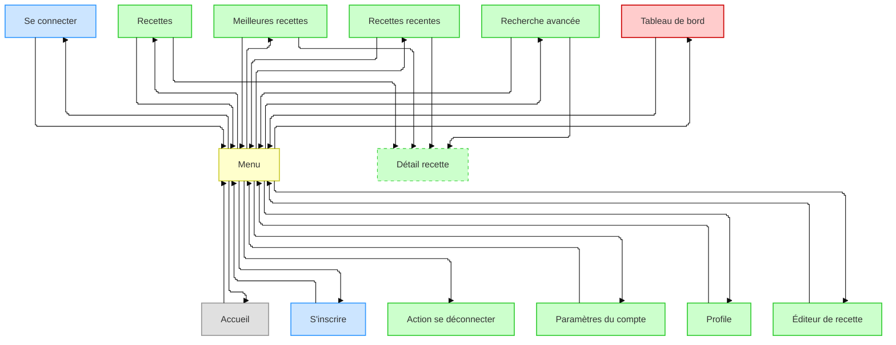

# Projet Fil Rouge:

## Gastronome Créatif

**Dossier Projet CDA**

**Par Ceyhane Yilmaz**

**2iSA Millau - 30 mai 2025**

---
hideInToc: true
---

# Sommaire

<TocB columns="2" listClass="{font-weight: bold}" maxDepth="3"/>


---
layout: intro
---

# Présentation personnelle

<v-clicks depth="2">

- Ceyhane YILMAZ, 25 ans
- Curieux des technologies
- Concepteur Développeur d'Application (en devenir)\*
- **Parcours :**
  - Restauration (Rivesaltes)
  - Licence Informatique (Perpignan)
  - Licence de Japonais (Toulouse)
  - Intérim divers (Millau)
  - Expériences autodidactes en programmation

</v-clicks>

---
layout: center
transition: slide-up
---

# Formation CDA

---
transition: slide-up
---

## Structure


<!--
3 activités, 2 jalons

Développer une appli

Concevoir et développer en couches

deployer
-->

---
layout: two-cols-header
transition: slide-up
---

## Le projet "Fil Rouge" et son objectif

<div class="grid grid-cols-2">

<v-clicks>

- Mise en situation professionnelle
- Cohérence avec les apprentissages
- Support pour les évaluations (EPCF)
- Utilisations de nombreux outils et technologies
- Application des compétences acquises

</v-clicks>

<v-clicks>

- Plateforme web "Gastronome Créatif"
- Mise en relation de passionnés de cuisine
- Découverte et partage de recettes
- Interface responsive et intuitive
- fonctionnalités exclusives aux administrateurs
- Exigences RGPD

</v-clicks>

</div>

<!--
[click] cahier des charges + deadline

[click] CDA apprend MVC, Fetch, POO

[click] simple pour évaluer car commun a tous

[click] en context / non isolé (exercices moodle après leçons)

[click] 2 jalons, 3 activités, progressif
-->

---

## Compétences mobilisées

<v-clicks depth="1">

- A1 – Développer une application sécurisée
  - Développer des interfaces utilisateurs
  - Développer des composants métiers
- A2 – Concevoir et développer une application sécurisée organisée en couches
  - Développer des composants d'accès aux données SQL et NoSQL
- Compétences transverses
  - Actualiser et partager ses compétences en conception et développement

</v-clicks>

<!-- - Préparer le déploiement sécurisé  -->

---
layout: two-cols-header
---

# Spécifications techniques

::left::

<v-clicks depth="2">

- **Framework Back-end :** ASP.NET Core MVC
- **Langage Back-end :** C#
	- **Front-end :** HTML5, CSS3, JavaScript/TypeScript
- **Base de données :** PostgreSQL (Docker)
- **IDE :** JetBrains Rider & VSCode
- **Gestion de version :** Git/GitHub

</v-clicks>

::right::

<div class="h-100 w-100 relative ">

<div v-click="[1,2]" class="absolute left-0 top-0 flex gap-2 h-full w-full">

</div>

<div v-click="[2,3]" class="absolute left-0 top-0 flex gap-2 h-full w-full">

</div>

<div v-click="[3,4]" class="absolute left-0 top-0 grid grid-cols-2 grid-rows-2 gap-2 h-full w-full">


</div>

<div v-click="[4,5]" class="absolute left-0 top-0 flex gap-2 h-full w-full">

</div>

<div v-click="[5,6]" class="absolute left-0 top-0 grid grid-cols-2 grid-rows-2 gap-2 h-full w-full">


</div>

<div v-click="6" class="absolute left-0 top-0 grid grid-cols-1 grid-rows-2 gap-2 h-full w-full">


</div>

</div>

---
clicks: 7
---

## Architecture technique (MVC)

<div v-motion
  :initial="{ scale: 1.2, x: 0, y: 0 , transition: {
   duration: 200, 
  }}"
  :enter="{ scale: 1, x: 0, y: 0, transition: {
   duration: 500, 
  }}"
  :click-1="{ scale: 2.2, x: 400, y: 300 }"
  :click-2="{ scale: 1.3, x: 80, y: -200 }"
  :click-3="{ scale: 2.2, x: 100, y: -300 }"
  :click-4="{ x: -300 }"
  :click-5="{ x: 500}"
  :click-6="{ x: 400, y: 300}"
  :click-7="{ scale: 1, x: 0, y: 0}"
	>


</div>

<!--
séparation responsabilités,
maintenance,
testabilité,
réutilisabilité,
collaboration,
flexibilité
-->

---
clicks: 6
---

## Base de données

<div v-motion
  :initial="{ scale: 1.2, x: 0, y: 0 , transition: {
   duration: 200, 
  }}"
  :enter="{ scale: 1, x: 0, y: 0, transition: {
   duration: 500, 
  }}"
  :click-1="{ scale: 2.2, x: 750, y: 250 }"
  :click-2="{ x: -750 }"
  :click-3="{ x: 0 }"
  :click-4="{ x: 750, y: -200 }"
  :click-5="{ x: -50, y: -300 }"
  :click-6="{ scale: 1, x: 0, y: 0}"
>


</div>

<!--
Deux tables d'association
-->

---
clicks: 8
---

# Diagramme de navigation

<div v-motion
  :initial="{ scale: 1.2, x: 0, y: 0 , transition: {
   duration: 200, 
  }}"
  :enter="{ scale: 1, x: 0, y: 0, transition: {
   duration: 500, 
  }}"
  :click-1="{ scale: 5, x: 150, y: 400 }"
  :click-2="{ y: 200 }"
  :click-3="{ scale: 5, x: 1800, y: 0}"
  :click-4="{ scale: 6, x: 700, y: -200}"
  :click-5="{ scale: 6, x: 1200, y: 0}"
  :click-6="{ scale: 3, x: -220, y: 100 }"
  :click-7="{ scale: 6, x: -2100, y: 0}"
  :click-8="{ scale: 1, x: 0, y: 0}"
	>




</div>

---
layout: center
---

# L'application en action : code représentatif

<Link to="demo"> Vidéo démonstration du site </Link>
<br>
<Link to="site"> démonstration du site en temps réel </Link>

---

## Modèle de recette

````md magic-move {class:'!children:overflow-x-auto !children:overflow-y-scroll h-100 !children:max-h-100'}
```cs {all}
public class Recipe
{

}
```

```cs {3-10|4|5|6|7|8|9|10}
public class Recipe
{
	// Attributs remplis par le contrôleur via l'ORM ou un formulaire
	public int id { get; set; }
	public string? title { get; set; }
	public TimeSpan? preparation_time { get; set; }
	public TimeSpan? cooking_time { get; set; }
	public int? creator_id { get; set; }
	public int difficulty { get; set; }
	public string? image_path { get; set; }
}
```

```cs {3,5-13|6|7|8|9|10|11|12|13}
public class Recipe
{
	// Attributs remplis par le contrôleur via l'ORM ou un formulaire

	// Attributs additionnels necessaires aux contrôleurs
	public IFormFile? image { get; set; }
	public User? creator { get; set; }
	public List<Step> steps { get; set; } = new();
	public List<Review> reviews { get; set; } = new();
	public List<Category> categories { get; set; } = new();
	public List<Ingredient> ingredients { get; set; } = new();
	public List<int> categories_ids { get; set; } = new();
	public List<int> ingredients_ids { get; set; } = new();
}
```

```cs {7-12}
public class Recipe
{
	// Attributs remplis par le contrôleur via l'ORM ou un formulaire

	// Attributs additionnels necessaires aux contrôleurs

	// Attributs additionnels pour les cartes de recettes
	public int ingredients_count { get; set; }
	public int steps_count { get; set; }
	public int reviews_count { get; set; }
	public double review_rating { get; set; }
}
```

```cs {4-6,9-10,12-13,16-17|4-7|9-11|12-14|16-18}
public class Recipe
{
	...
	[Required()]
	[DisplayName("Title")]
	[MaxLength(100, ErrorMessage = "{0} has to be under {1} characters.")]
	public string? title { get; set; }
			...
	[Required()]
	[Range(1, 10)]
	public int difficulty { get; set; }
			...
	[MaxLength(100, ErrorMessage = "{0} name has to be under {1} characters.")]
	public string? image_path { get; set; }
			...
	[Required()]
	[DataType(DataType.Upload)]
	public IFormFile? image { get; set; }
			...
}
```
````

<!--
TODO to fix
TODO decide what to do
-->

---

## Contrôleur de l'accueil

````md magic-move
```cs
public IActionResult Index()
{

}
```

```cs
public IActionResult Index()
{
    string query = @"";
}
```

```cs
public IActionResult Index()
{
    string query = @"SELECT
                        r.*
                    FROM recipes r";
}
```

```cs
public IActionResult Index()
{
    string query = @"SELECT
                        r.*,
                        u.username, u.image_path
                    FROM recipes r
                    LEFT JOIN users u ON r.creator_id = u.id";
}
```

```cs
public IActionResult Index()
{
    string query = @"SELECT
                        r.*,
                        COUNT(DISTINCT s.*) AS steps_count,
                        COUNT(DISTINCT ri.*) AS ingredients_count,
                        COUNT(DISTINCT rw.*) AS reviews_count,
                        ROUND(COALESCE(AVG(rw.rating), 0), 2) AS review_rating,
                        u.username, u.image_path
                    FROM recipes r
                    LEFT JOIN users u ON r.creator_id = u.id
                    LEFT JOIN reviews rw ON rw.recipe_id = r.id
                    LEFT JOIN recipes_ingredients ri ON ri.recipe_id = r.id
                    LEFT JOIN steps s ON s.recipe_id = r.id";
}
```

```cs
public IActionResult Index()
{
    string query = @"SELECT
                        r.*,
                        COUNT(DISTINCT s.*) AS steps_count,
                        COUNT(DISTINCT ri.*) AS ingredients_count,
                        COUNT(DISTINCT rw.*) AS reviews_count,
                        ROUND(COALESCE(AVG(rw.rating), 0), 2) AS review_rating,
                        u.username, u.image_path
                    FROM recipes r
                    LEFT JOIN users u ON r.creator_id = u.id
                    LEFT JOIN reviews rw ON rw.recipe_id = r.id
                    LEFT JOIN recipes_ingredients ri ON ri.recipe_id = r.id
                    LEFT JOIN steps s ON s.recipe_id = r.id
                    GROUP BY r.id, u.username, u.image_path";
}
```

```cs
public IActionResult Index()
{
    string query = @"SELECT
                        r.*,
                        COUNT(DISTINCT s.*) AS steps_count,
                        COUNT(DISTINCT ri.*) AS ingredients_count,
                        COUNT(DISTINCT rw.*) AS reviews_count,
                        ROUND(COALESCE(AVG(rw.rating), 0), 2) AS review_rating,
                        u.username, u.image_path
                    FROM recipes r
                    LEFT JOIN users u ON r.creator_id = u.id
                    LEFT JOIN reviews rw ON rw.recipe_id = r.id
                    LEFT JOIN recipes_ingredients ri ON ri.recipe_id = r.id
                    LEFT JOIN steps s ON s.recipe_id = r.id
                    GROUP BY r.id, u.username, u.image_path
                    ORDER BY review_rating DESC";
}
```

```cs
public IActionResult Index()
{
    string query = @"SELECT
                        r.*,
                        COUNT(DISTINCT s.*) AS steps_count,
                        COUNT(DISTINCT ri.*) AS ingredients_count,
                        COUNT(DISTINCT rw.*) AS reviews_count,
                        ROUND(COALESCE(AVG(rw.rating), 0), 2) AS review_rating,
                        u.username, u.image_path
                    FROM recipes r
                    LEFT JOIN users u ON r.creator_id = u.id
                    LEFT JOIN reviews rw ON rw.recipe_id = r.id
                    LEFT JOIN recipes_ingredients ri ON ri.recipe_id = r.id
                    LEFT JOIN steps s ON s.recipe_id = r.id
                    GROUP BY r.id, u.username, u.image_path
                    ORDER BY review_rating DESC
                    LIMIT 10";
}
```

```cs
public IActionResult Index()
{
    string query = @"...";
    List<Recipe> recipes;
}
```

```cs
public IActionResult Index()
{
    string query = @"...";
    List<Recipe> recipes;
    using ()
    {

    }
}
```

```cs
public IActionResult Index()
{
    string query = @"...";
    List<Recipe> recipes;
    using (var connection = new NpgsqlConnection(_connectionString))
    {

    }
}
```

```cs
public IActionResult Index()
{
    string query = @"...";
    List<Recipe> recipes;
    using (var connection = new NpgsqlConnection(_connectionString))
    {
        recipes = connection.Query();
    }
}
```

```cs
public IActionResult Index()
{
    string query = @"...";
    List<Recipe> recipes;
    using (var connection = new NpgsqlConnection(_connectionString))
    {
        recipes = connection.Query().ToList();
    }
}
```

```cs
public IActionResult Index()
{
    string query = @"...";
    List<Recipe> recipes;
    using (var connection = new NpgsqlConnection(_connectionString))
    {
        recipes = connection.Query< Recipe>().ToList();
    }
}
```

```cs
public IActionResult Index()
{
    string query = @"...";
    List<Recipe> recipes;
    using (var connection = new NpgsqlConnection(_connectionString))
    {
        recipes = connection.Query< Recipe>(query).ToList();
    }
}
```

```cs
public IActionResult Index()
{
    string query = @"...";
    List<Recipe> recipes;
    using (var connection = new NpgsqlConnection(_connectionString))
    {
        recipes = connection.Query< Recipe>(query, splitOn: "id, username").ToList();
    }
}
```

```cs
public IActionResult Index()
{
    string query = @"...";
    List<Recipe> recipes;
    using (var connection = new NpgsqlConnection(_connectionString))
    {
        recipes = connection.Query<Recipe, User, Recipe>(query, (recipe, user) =>
            {

            },
            splitOn: "id, username")
            .ToList();
    }
}
```

```cs
public IActionResult Index()
{
    string query = @"...";
    List<Recipe> recipes;
    using (var connection = new NpgsqlConnection(_connectionString))
    {
        recipes = connection.Query<Recipe, User, Recipe>(query, (recipe, user) =>
            {
                recipe.creator = user;
                return recipe;
            },
            splitOn: "id, username")
            .ToList();
    }
}
```

```cs
public IActionResult Index()
{
    string query = @"...";
    List<Recipe> recipes;
    try
    {
        using (var connection = new NpgsqlConnection(_connectionString))
        {
            // execution de la requete et recuperation des donnees dans la liste "recipes"
        }
    }
}
```

```cs
public IActionResult Index()
{
    string query = @"...";
    List<Recipe> recipes;
    try
    {
        using (var connection = new NpgsqlConnection(_connectionString))
        {
            // execution de la requete et recuperation des donnees dans la liste "recipes"
        }
    }
    catch (NpgsqlException ne)
    {

    }
    catch (Exception e)
    {

    }
}
```

```cs {all|14|15|16}
public IActionResult Index()
{
    string query = @"...";
    List<Recipe> recipes;
    try
    {
        using (var connection = new NpgsqlConnection(_connectionString))
        {
            // execution de la requete et recuperation des donnees dans la liste "recipes"
        }
    }
    catch (NpgsqlException ne)
    {
        TempData["StatusMessage"] = "The server could not connect to the database, try again later.";
        TempData["StatusMessageType"] = "error";
        return View(new List<Recipe>());
    }
    catch (Exception e)
    {

    }
}
```

```cs
public IActionResult Index()
{
    string query = @"...";
    List<Recipe> recipes;
    try
    {
        using (var connection = new NpgsqlConnection(_connectionString))
        {
            // execution de la requete et recuperation des donnees dans la liste "recipes"
        }
    }
    catch (NpgsqlException ne)
    {
        // Affiche erreur avec la base de donnees et renvoie une liste vide
    }
    catch (Exception e)
    {
        TempData["StatusMessage"] = "Error getting recipes from the database, try again later.";
        TempData["StatusMessageType"] = "error";
        return View(new List<Recipe>());
    }
}
```

```cs
public IActionResult Index()
{
    string query = @"...";
    List<Recipe> recipes;
    try
    {
        using (var connection = new NpgsqlConnection(_connectionString))
        {
            // execution de la requete et recuperation des donnees dans la liste "recipes"
        }
    }
    catch (NpgsqlException ne)
    {
        // Affiche erreur avec la base de donnees et renvoie une liste vide
    }
    catch (Exception e)
    {
        // Affiche erreur inconnue et renvoie une liste vide
    }

    return View(recipes);
}
```
````

---

## Vue partielle d'une carte de recette

````md magic-move
```cs {all}{maxHeight:'90%'}
@model Recipe
@{
	var formattedRating = Model.review_rating.ToString("0.0");
}
```

```cs {all}{maxHeight:'90%'}
@* --- Récupération des données du contrôleur --- *@

<article class="recipe">

</article>
```

```cs {all}{maxHeight:'90%'}
@* --- Récupération des données du contrôleur --- *@

<article class="recipe">
	@* --- Recipe Image Link --- *@
		

</article>
```

```cs {all}{maxHeight:'90%'}
@* --- Récupération des données du contrôleur --- *@
<article class="recipe">
	@* --- Recipe Image Link --- *@
	<a asp-controller="Recipes" asp-action="Detail" asp-route-id="@Model.id" class="recipe-image-link">
		
	</a>
</article>
```

```cs {all}{maxHeight:'90%'}
@* --- Récupération des données du contrôleur --- *@
<article class="recipe">
	@* --- Recipe Image Link --- *@
	<div class="recipe-body">

	</div>
</article>
```

```cs {all}{maxHeight:'90%'}
@* --- Récupération des données du contrôleur --- *@
<article class="recipe">
	@* --- Recipe Image Link --- *@
	<div class="recipe-body">
		@* --- Recipe Title --- *@
		<a asp-controller="Recipes" asp-action="Detail" asp-route-id="@Model.id" class="recipe-title-link">
			<h3 class="recipe-title">@Model.title</h3>
		</a>
	</div>
</article>
```

```cs {all}{maxHeight:'90%'}
@* --- Récupération des données du contrôleur --- *@
<article class="recipe">
	@* --- Recipe Image Link --- *@
	<div class="recipe-body">
		@* --- Recipe Title --- *@
		@* --- Creator Info --- *@
		{
			<div class="recipe-creator">
				<a asp-controller="Users" asp-action="Detail" asp-route-id="@Model.creator_id"
					title="View @Model.creator.username's profile">
					
					<span class="creator-name">@Model.creator.username</span>
				</a>
			</div>
		}
	</div>
</article>
```

```cs {all}{maxHeight:'90%'}
@* --- Récupération des données du contrôleur --- *@
<article class="recipe">
	@* --- Recipe Image Link --- *@
	<div class="recipe-body">
		@* --- Recipe Title --- *@
		@* --- Creator Info --- *@
		@* --- Recipe Main Stats (Time) --- *@
		<div class="recipe-stats">
			<div class="stat-item" title="Preparation Time">
				
				<span class="icon-text">@Model.preparation_time</span>
			</div>
			<div class="stat-item" title="Cooking Time">
				
				<span class="icon-text">@Model.cooking_time</span>
			</div>
			<div class="stat-item" title="Difficulty">
				
				<span class="icon-text">@Model.difficulty</span>
			</div>
		</div>
</article>
```

```cs {all}{maxHeight:'90%'}
@* --- Récupération des données du contrôleur --- *@
<article class="recipe">
	@* --- Recipe Image Link --- *@
	<div class="recipe-body">
		@* --- Recipe Title --- *@
		@* --- Creator Info --- *@
		@* --- Recipe Main Stats (Time) --- *@
		@* --- Recipe Additional Stats (Counts, Rating) --- *@
		<div class="recipe-stats-extra">
			<div class="stat-item" title="@Model.ingredients_count Ingredients">
				
				<span class="icon-text">@Model.ingredients_count</span>
			</div>
			<div class="stat-item" title="@Model.steps_count Steps">
				
				<span class="icon-text">@Model.steps_count</span>
			</div>
			<div class="stat-item" title="@Model.reviews_count Reviews">
				
				<span class="icon-text">@Model.reviews_count</span>
			</div>
			<div class="stat-item" title="Rating: @formattedRating / 5">
				
				<span class="icon-text">@formattedRating</span>
			</div>
		</div>
	</div>
</article>
```

```cs {all}{maxHeight:'90%'}
@* --- Récupération des données du contrôleur --- *@
<article class="recipe">
	@* --- Recipe Image Link --- *@
	<div class="recipe-body">
		@* --- Recipe Title --- *@
		@* --- Creator Info --- *@
		@* --- Recipe Main Stats (Time) --- *@
		@* --- Recipe Additional Stats (Counts, Rating) --- *@
	</div>
</article>
```
````


---

<div class="absolute">
```cs {all|12-17|15}
@model List<Recipe>
@{
	ViewData["Title"] = "Bytes of Bites home page";
}

<div class="recipe-showcase">
	<section class="recipes-section" id="recent-recipes">
		<h2 class="main-title">Top 10 recipes</h2>
		<div class="carousel">

			<ul class="recipes">
				@foreach (Recipe recipe in @Model!)
				{
					<li class="recipe-wrapper">
						<partial name="_RecipeCard" for="@recipe" />
					</li>
				}
			</ul>
		</div>
	</section>
</div>
...
```
</div>


<!-- TODO add the actual view -->

---
layout: two-cols-header
---

# Sécurité web

## Deux types d'attaques principales :

::left::

<v-clicks depth="3">

- **Injection SQL**
  - **Protection :**
    - ORM et requêtes paramétrées
    - Validation des entrées utilisateur

- **CSRF (Cross-Site Request Forgery)**
  - **Protection :**
    - Tokens anti-CSRF à valider
    - Validation des requêtes avec ASP.NET Core

</v-clicks>

::right::

<div class="absolute">

</div>
<div class="absolute" v-click="[1,3]">

</div>
<div class="absolute" v-click="[3,4]">

```cs {all|13}
public IActionResult SearchResult(string? searchInput)
{
	string query = $@"SELECT * FROM recipes
									...
									WHERE title like @search"
	...
	recipes = connexion.Query<Recipe, User, Recipe>
	(query, (recipe, user) =>
		{
			recipe.creator = user;
			return recipe;
		},
		new { search = searchInput},
		splitOn: "id, username"
	).ToList();
}
```

</div>
<div class="absolute" v-click="[4,5]">

```cs
if (review.rating < 1 || review.rating > 5 ||
		string.IsNullOrWhiteSpace(review.comment))
{
	TempData["ReviewError"] = "Invalid rating or comment.";
	return RedirectToAction("Detail", new { review.recipe_id });
}
```

</div>
<div class="absolute" v-click="[5,7]">

</div>
<div class="absolute" v-click="[7,8]">

````md magic-move
```html
<form>
	@Html.AntiForgeryToken()
</form>

-->

<form>
	<input name="__RequestVerificationToken" type="hidden" 
	value="CfDJ8OFv7VAmxAFFonoDe419EpsEp6gCKs80e1pAlPhUxahfh7" />
</form>
```
````

</div>
<div class="absolute" v-click="[8,9]">

```cs
[HttpPost]
AddReview([FromForm] Review review)
{
	...
}
```
</div>

<div class="absolute" v-click="[9,10]">

```cs
[HttpPost]
[ValidateAntiForgeryToken]
AddReview([FromForm] Review review)
{
	...
}
```
</div>

<div class="absolute" v-click="10">
```html {all|5-6|9-12|8-9|12-13}
<h1>Bravo, vous avez gagné 1000€</h1>

<form
  id="csrf-form"
  action="https://your-bank.com/transfer"
  method="POST"
  target="_blank"
>
  <input type="hidden" name="to_account" 
	value="meilleur_hacker" />
  <input type="hidden" name="amount" value="999999" />
  <input type="submit" value="Réclamez vos 1000€" />
</form>

<p>Cliquez sur le bouton du dessus pour les obtenir</p>
```

</div>

<!-- TODO CSRF -->
<!-- |4-5|7-11|8-9|12-13 -->

---
layout: full
---

<div v-click.hide="8" class="absolute">

# Gestion du projet

<v-clicks depth="2">

- **Compétence Évaluée :** "Contribuer à la gestion d’un projet informatique".
- **Méthodologie :**
  - **Début :** Exploration sans planification formelle -> Retard accumulé.
  - **Mise en place (tardive) :** Tableau Kanban sur **GitHub Projects**.
- **Apprentissages :** Importance cruciale de la planification et définition des contraintes **dès le début**.
- **Communication :** Interactions avec les formateurs via Teams ou en salle.

</v-clicks>
</div>
<div v-click.hide="[0,8]">


</div>

---
layout: two-cols-header
---

# Bilan | conclusion

::left::

## Apports

<v-clicks>

- Première expérience complète de développement
- Application concrète des connaissances
- Maîtrise d'outils et de frameworks

</v-clicks>

::right::

## Difficultés

<v-clicks>

- Gestion du temps et organisation
- Communication technique
- Finalisation des tâches

</v-clicks>


<!-- TODO icons good / bad -->

---

# Perspectives

<v-clicks>

- Amélioration de la gestion personnelle du projet
- Priorisation de l'implémentation des fonctionnalités de base
- Développement de meilleures habitudes de travail

</v-clicks>

---
hideInToc: true
layout: end
---

# Questions

Merci pour votre attention

---
hideInToc: true
---

# Annexe

- [soundsphere](https://github.com/semyon422/soundsphere)
- [yomitan](https://github.com/yomidevs/yomitan)
- [anki](https://github.com/ankitects/anki/)
- [mpv](https://github.com/mpv-player/mpv)

- [Documentation microsoft concernant les attaques CSRF](https://learn.microsoft.com/en-us/aspnet/core/security/anti-request-forgery?view=aspnetcore-9.0)


---
routeAlias: demo
hideInToc: true
---

<SlidevVideo controls class="h-auto">
  <source src="/media/1_welcome.mp4" />
</SlidevVideo>

---

<SlidevVideo controls class="h-full">
  <source src="/media/2_add.mp4" />
</SlidevVideo>

---

<SlidevVideo controls class="h-full">
  <source src="/media/3_profile_check.mp4" />
</SlidevVideo>

---

<SlidevVideo controls class="h-full">
  <source src="/media/4_account_settings.mp4" />
</SlidevVideo>

---
routeAlias: site
layout: iframeB
url: https://localhost:44344/
---
