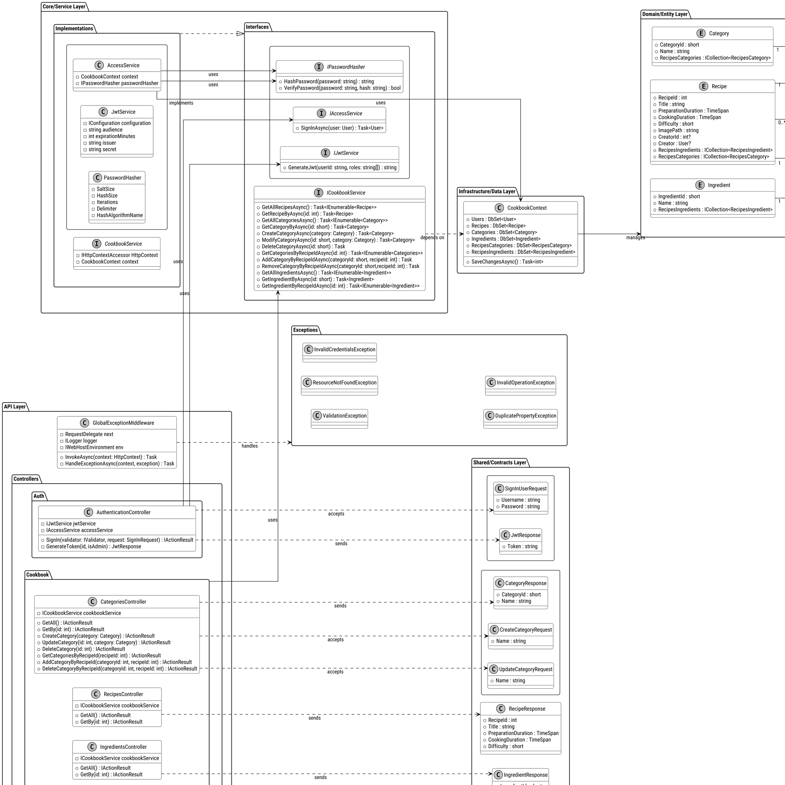

## Diagramme de classe

```plantuml
@startuml
' Preset Styles by Jeriel Jan

' Preset: Monochrome
!$STYLE_DEFAULT_ACCENT = "#000"
!$STYLE_DEFAULT_BGC = "#FFF"
!$STYLE_DEFAULT_FGC = "#000"

' Preset: Material Light Blue (200)
!$STYLE_LIGHT_ACCENT = "#81D4FA"
!$STYLE_LIGHT_BGC = "#FFF"
!$STYLE_LIGHT_FGC = "#000"

' Preset: Material Light Blue (800)
!$STYLE_DARK_ACCENT = "#0277BD"
!$STYLE_DARK_BGC = "#FFF"
!$STYLE_DARK_FGC = "#000"

' Preset: Material Light Blue (800)
!$STYLE_MIDNIGHT_ACCENT = "#0277BD"
!$STYLE_MIDNIGHT_BGC = "#000"
!$STYLE_MIDNIGHT_FGC = "#FFF"
' Color Definition
' Choose the style you want by applying them here.

!$STYLE_ACCENT = $STYLE_DEFAULT_FGC
!$STYLE_BGC = $STYLE_DEFAULT_BGC
!$STYLE_FGC = $STYLE_DEFAULT_FGC

' RECOMMENDED STYLE
' -=- DO NOT EDIT THIS SECTION. -=-
' See Custom Style section below to override items here.

left to right direction
' top to bottom direction

skinparam {

    ' Global Options
    DPI 200
    Shadowing false
    DefaultFontName Roboto Condensed
    DefaultMonospacedFontName Inconsolata
    DefaultFontColor $STYLE_FGC

    ' Styles - Borders

    ArrowColor $STYLE_ACCENT
    ActivityBorderColor $STYLE_ACCENT
    ActivityDiamondBorderColor $STYLE_ACCENT
    ActorBorderColor $STYLE_ACCENT
    AgentBorderColor $STYLE_ACCENT
    ArtifactBorderColor $STYLE_ACCENT
    BoundaryBorderColor $STYLE_ACCENT
    ClassBorderColor $STYLE_ACCENT
    CloudBorderColor $STYLE_ACCENT
    CollectionsBorderColor $STYLE_ACCENT
    ComponentBorderColor $STYLE_ACCENT
    ControlBorderColor $STYLE_ACCENT
    DatabaseBorderColor $STYLE_ACCENT
    EntityBorderColor $STYLE_ACCENT
    FileBorderColor $STYLE_ACCENT
    FolderBorderColor $STYLE_ACCENT
    FrameBorderColor $STYLE_ACCENT
    InterfaceBorderColor $STYLE_ACCENT
    LegendBorderColor $STYLE_ACCENT
    NodeBorderColor $STYLE_ACCENT
    NoteBorderColor $STYLE_ACCENT
    ObjectBorderColor $STYLE_ACCENT
    PackageBorderColor $STYLE_ACCENT
    ParticipantBorderColor $STYLE_ACCENT
    PartitionBorderColor $STYLE_ACCENT
    QueueBorderColor $STYLE_ACCENT
    RectangleBorderColor $STYLE_ACCENT
    SequenceBoxBorderColor $STYLE_ACCENT
    SequenceDividerBorderColor $STYLE_ACCENT
    SequenceGroupBorderColor $STYLE_ACCENT
    SequenceLifeLineBorderColor $STYLE_ACCENT
    SequenceReferenceBorderColor $STYLE_ACCENT
    StackBorderColor $STYLE_ACCENT
    StateBorderColor $STYLE_ACCENT
    StorageBorderColor $STYLE_ACCENT
    SwimlaneBorderColor $STYLE_ACCENT
    UsecaseBorderColor $STYLE_ACCENT

    ' Styles - Backgrounds

    ActivityBackgroundColor $STYLE_BGC
    ActivityDiamondBackgroundColor $STYLE_BGC
    ActorBackgroundColor $STYLE_BGC
    AgentBackgroundColor $STYLE_BGC
    ArtifactBackgroundColor $STYLE_BGC
    BackgroundColor $STYLE_BGC
    BoundaryBackgroundColor $STYLE_BGC
    ClassBackgroundColor $STYLE_BGC
    ClassHeaderBackgroundColor $STYLE_BGC
    CloudBackgroundColor $STYLE_BGC
    CollectionsBackgroundColor $STYLE_BGC
    ComponentBackgroundColor $STYLE_BGC
    ControlBackgroundColor $STYLE_BGC
    DatabaseBackgroundColor $STYLE_BGC
    EntityBackgroundColor $STYLE_BGC
    FileBackgroundColor $STYLE_BGC
    FolderBackgroundColor $STYLE_BGC
    FrameBackgroundColor $STYLE_BGC
    IconPackageBackgroundColor $STYLE_BGC
    IconPrivateBackgroundColor $STYLE_BGC
    IconProtectedBackgroundColor $STYLE_BGC
    IconPublicBackgroundColor $STYLE_BGC
    InterfaceBackgroundColor $STYLE_BGC
    LegendBackgroundColor $STYLE_BGC
    NodeBackgroundColor $STYLE_BGC
    NoteBackgroundColor $STYLE_BGC
    ObjectBackgroundColor $STYLE_BGC
    PackageBackgroundColor $STYLE_BGC
    ParticipantBackgroundColor $STYLE_BGC
    PartitionBackgroundColor $STYLE_BGC
    QueueBackgroundColor $STYLE_BGC
    RectangleBackgroundColor $STYLE_BGC
    SequenceBoxBackgroundColor $STYLE_BGC
    SequenceDividerBackgroundColor $STYLE_BGC
    SequenceGroupBackgroundColor $STYLE_BGC
    SequenceGroupBodyBackgroundColor $STYLE_BGC
    SequenceLifeLineBackgroundColor $STYLE_BGC
    SequenceReferenceBackgroundColor $STYLE_BGC
    SequenceReferenceHeaderBackgroundColor $STYLE_BGC
    StackBackgroundColor $STYLE_BGC
    StateBackgroundColor $STYLE_BGC
    StereotypeABackgroundColor $STYLE_BGC
    StereotypeCBackgroundColor $STYLE_BGC
    StereotypeEBackgroundColor $STYLE_BGC
    StereotypeIBackgroundColor $STYLE_BGC
    StereotypeNBackgroundColor $STYLE_BGC
    StorageBackgroundColor $STYLE_BGC
    TitleBackgroundColor $STYLE_BGC
    UsecaseBackgroundColor $STYLE_BGC

    ' -=- END OF RECOMMENDED STYLE -=-

    ' Other Settings
    ' These settings are included in the language specs, but
    ' it's not recommended to be applied.

        'TitleBorderColor $STYLE_ACCENT
        'DiagramBorderColor $STYLE_ACCENT

    ' CUSTOM STYLE
    ' All items below can be safely commented out.
    ' This will override the options listed above.
    roundcorner 8
    Monochrome true
    linetype ortho

    NoteFontName Roboto Condensed
    NoteFontStyle Italic
    NoteBackgroundColor $STYLE_BGC

}

package "API Layer" {
  package Controllers {
    package Cookbook {
      class CategoriesController {
        - ICookbookService cookbookService
        + GetAll() : IActionResult
        + GetBy(id: int) : IActionResult
        + CreateCategory(category: Category) : IActionResult
        + UpdateCategory(id: int, category: Category) : IActionResult
        + DeleteCategory(id: int) : IActionResult
        + GetCategoriesByRecipeId(recipeId: int) : IActionResult
        + AddCategoryByRecipeId(categoryId: int, recipeId: int) : IActionResult
        + DeleteCategoryByRecipeId(categoryId: int, recipeId: int) : IActionResult
      }
      class RecipesController {
        - ICookbookService cookbookService
        + GetAll() : IActionResult
        + GetBy(id: int) : IActionResult
      }

      class IngredientsController {
        - ICookbookService cookbookService
        + GetAll() : IActionResult
        + GetBy(id: int) : IActionResult
      }
    }
    package Auth {
      class AuthenticationController {
        - IJwtService jwtService
        - IAccessService accessService
        + SignIn(validator: IValidator, request: SignInRequest) : IActionResult
        - GenerateToken(id, isAdmin) : JwtResponse
      }
    }
  }

  class GlobalExceptionMiddleware {
    - RequestDelegate next
    - ILogger logger
    - IWebHostEnvironment env
    + InvokeAsync(context: HttpContext) : Task
    - HandleExceptionAsync(context, exception) : Task
  }
}

package "Core/Service Layer" {
  package Implementations {
    interface CookbookService {
      - IHttpContextAccessor HttpContext
      - CookbookContext context
    }

    rectangle " " as AuthImpl {
      class AccessService {
        - CookbookContext context
        - IPasswordHasher passwordHasher
      }

      class JwtService {
        - IConfiguration configuration
        - string audience
        - int expirationMinutes
        - string issuer
        - string secret
      }

      class PasswordHasher {
        - SaltSize
        - HashSize
        - Iterations
        - Delimiter
        - HashAlgorithmName
      }
    }
  }

  package Interfaces {
    interface ICookbookService {
      + GetAllRecipesAsync() : Task<IEnumerable<Recipe>>
      + GetRecipeByAsync(id: int) : Task<Recipe>
      + GetAllCategoriesAsync() : Task<IEnumerable<Category>>
      + GetCategoryByAsync(id: short) : Task<Category>
      + CreateCategoryAsync(category: Category) : Task<Category>
      + ModifyCategoryAsync(id: short, category: Category) : Task<Category>
      + DeleteCategoryAsync(id: short) : Task
      + GetCategoriesByRecipeIdAsync(id: int) : Task<IEnumerable<Categories>>
      + AddCategoryByRecipeIdAsync(categoryId: short, recipeId: int) : Task
      + RemoveCategoryByRecipeIdAsync(categoryId: short,recipeId: int) : Task
      + GetAllIngredientsAsync() : Task<IEnumerable<Ingredient>>
      + GetIngredientByAsync(id: short) : Task<Ingredient>
      + GetIngredientByRecipeIdAsync(id: int) : Task<IEnumerable<Ingredient>>
    }

    rectangle " " as AuthInterfaces {
      interface IAccessService {
        + SignInAsync(user: User) : Task<User>
      }

      interface IJwtService {
        + GenerateJwt(userId: string, roles: string[]) : string
      }

      interface IPasswordHasher {
        + HashPassword(password: string) : string
        + VerifyPassword(password: string, hash: string) : bool
      }
    }

  }
}

package "Infrastructure/Data Layer" {
  class CookbookContext {
    + Users : DbSet<User>
    + Recipes : DbSet<Recipe>
    + Categories : DbSet<Category>
    + Ingredients : DbSet<Ingredient>
    + RecipesCategories : DbSet<RecipesCategory>
    + RecipesIngredients : DbSet<RecipesIngredient>
    + SaveChangesAsync() : Task<int>
  }
}

package "Domain/Entity Layer" {
  entity Recipe {
    + RecipeId : int
    + Title : string
    + PreparationDuration : TimeSpan
    + CookingDuration : TimeSpan
    + Difficulty : short
    + ImagePath : string
    + CreatorId : int?
    + Creator : User?
    + RecipesIngredients : ICollection<RecipesIngredient>
    + RecipesCategories : ICollection<RecipesCategory>
  }

  entity User {
    + UserId : int
    + Username : string
    + Email : string
    + PasswordHash : string
    + IsAdmin : bool
    + ImagePath : string?
    + Recipes : ICollection<Recipe>
  }

  entity Category {
    + CategoryId : short
    + Name : string
    + RecipesCategories : ICollection<RecipesCategory>
  }

  entity Ingredient {
    + IngredientId : short
    + Name : string
    + RecipesIngredients : ICollection<RecipesIngredient>
  }

  entity RecipesCategory {
    + RecipeId : int
    + CategoryId : short
    + Category : Category
    + Recipe : Recipe
  }

  entity RecipesIngredient {
    + RecipeId : int
    + IngredientId : short
    + Quantity : decimal
    + Unit : string?
    + Ingredient : Ingredient
    + Recipe : Recipe
  }
}

package "Shared/Contracts Layer" {
  rectangle {
    class SignInUserRequest {
      + Username : string
      + Password : string
    }

    class JwtResponse {
      + Token : string
    }
  }

  rectangle {
    class CreateCategoryRequest {
      + Name : string
    }

    class UpdateCategoryRequest {
      + Name : string
    }

    class CategoryResponse {
      + CategoryId : short
      + Name : string
    }
  }

  class IngredientResponse {
    + IngredientId : short
    + Name : string
  }

  class RecipeResponse {
    + RecipeId : int
    + Title : string
    + PreparationDuration : TimeSpan
    + CookingDuration : TimeSpan
    + Difficulty : short
  }

}

package "Exceptions" {
  class ValidationException
  class ResourceNotFoundException
  class InvalidCredentialsException
  class DuplicatePropertyException
  class InvalidOperationException
}

' Relationships - Controllers
Cookbook --> ICookbookService : uses
AuthenticationController --> IAccessService : uses
AuthenticationController --> IJwtService : uses

' Relationships - Services
Implementations ..|> Interfaces : implements
ICookbookService ..> CookbookContext : depends on
' CookbookService ..|> ICookbookService : implements
' JwtService ..|> IJwtService : implements
' AccessService ..|> IAccessService : implements
AccessService --> CookbookContext : uses
AccessService --> IPasswordHasher : uses
AccessService --> IPasswordHasher : uses

' Relationships - Context
CookbookContext ----> "Domain/Entity Layer" : manages
' CookbookContext --> Recipe : manages
' CookbookContext --> User : manages
' CookbookContext --> Category : manages
' CookbookContext --> Ingredient : manages
' CookbookContext --> RecipesCategory : manages
' CookbookContext --> RecipesIngredient : manages

' Relationships - Entities
Recipe "1" -- "1..*" RecipesCategory
Recipe "1" -- "1..*" RecipesIngredient
Recipe "0..*" -- "1" User

Category "1" -- "0..*" RecipesCategory
Ingredient "1" -- "0..*" RecipesIngredient


' Middleware relationships
GlobalExceptionMiddleware ..> Exceptions : handles
' GlobalExceptionMiddleware ..> ResourceNotFoundException : handles
' GlobalExceptionMiddleware ..> InvalidCredentialsException : handles
' GlobalExceptionMiddleware ..> DuplicatePropertyException : handles
' GlobalExceptionMiddleware ..> ValidationException : handles

' Request mapping
CategoriesController ...> CreateCategoryRequest : accepts
CategoriesController ...> UpdateCategoryRequest : accepts
AuthenticationController ...> SignInUserRequest : accepts
AuthenticationController ...> JwtResponse : sends
IngredientsController ...> IngredientResponse : sends
CategoriesController ...> CategoryResponse : sends
RecipesController ...> RecipeResponse : sends


@enduml
```

