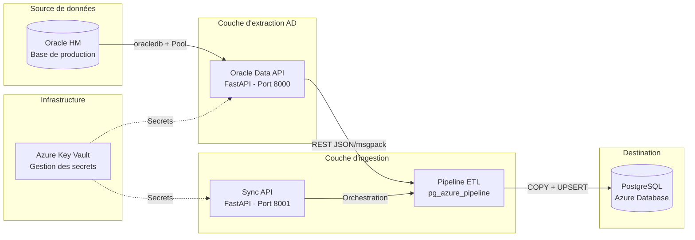
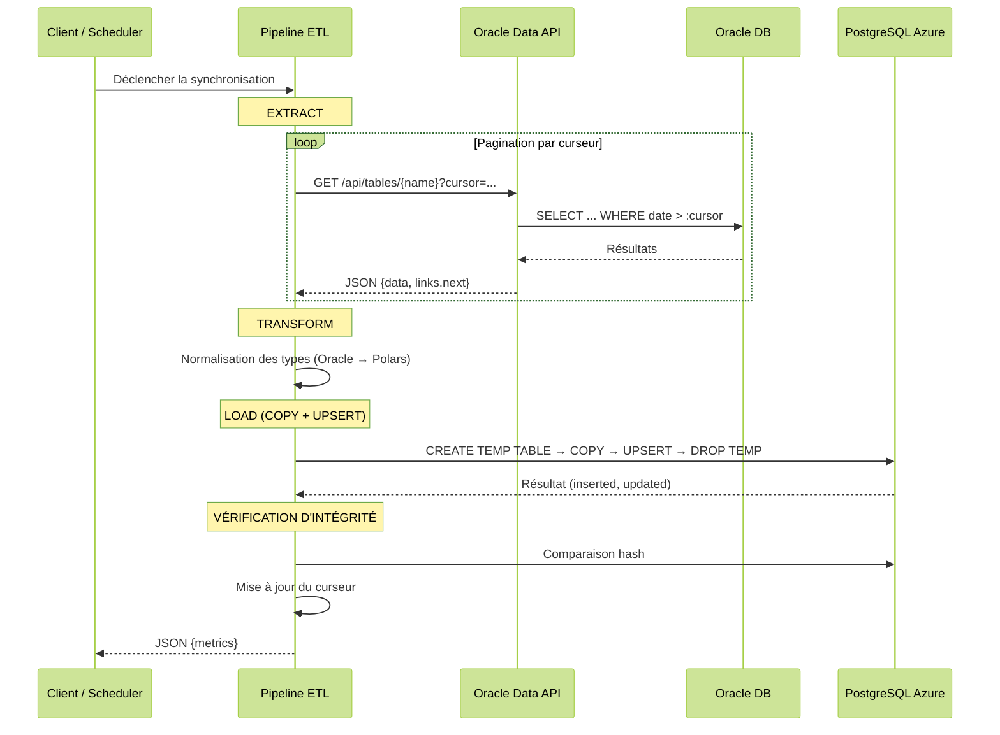

# Projet pour le titre CDA

## Ingestion de données hospitalière

**2iSA Millau - <Date/>**

**Par Ceyhane Yilmaz**

<div class="absolute right-5 top-0 h-80 w-80">
  
</div>

<div class="absolute right-5 top-80 h-80 w-80">
  
</div>

<style>
* {
  font-weight: bolder;
  color: #a8c321;
}
</style>

<!--
Bonjour à tous, je suis Ceyhane YILMAZ et je vais vous présenter mon projet de stage réalisé au Centre Hospitalier de Mende, dans le cadre de ma formation Concepteur Développeur d'Applications chez 2iSA.

Ce stage portait sur l'ingénierie de données hospitalières, et plus précisément sur la synchronisation de données depuis une base Oracle vers PostgreSQL Azure pour le service des urgences.
-->

---
hideInToc: true
---

# Sommaire

<Toc columns="2" listClass="{font-weight: bold}" maxDepth="1"/>

<!--
Voici le plan de ma présentation. Nous aborderons d'abord le contexte et les besoins, puis l'architecture technique, le parcours chronologique de développement, les aspects de sécurité, les tests, et enfin le bilan et les perspectives.
-->

---
layout: intro
---

# Présentations

<v-clicks depth="2">

- **Ceyhane YILMAZ** — Concepteur Développeur d'Applications
- ~10 ans de passion pour la tech : automatisation, résolution de problèmes
- **Parcours :**
  - Licence Informatique (Perpignan)
  - Projets open-source (_Soundsphere_, scripts d'automatisation)
  - Formation CDA chez **2iSA** (Millau)
  - Stage **data engineering** (Mende)

</v-clicks>

<!--
Je m'appelle Ceyhane YILMAZ. Depuis une dizaine d'années, je m'intéresse à l'informatique, que ce soit l'automatisation de tâches, la résolution de bugs ou l'exploration de nouvelles technologies.

[click] Mon parcours est assez atypique : après une première année de licence informatique à Perpignan, j'ai travaillé sur des projets personnels, notamment une contribution à un jeu vidéo open-source appelé Soundsphere, et des scripts d'automatisation.

[click] Aujourd'hui, je suis en formation CDA chez 2iSA à Millau. Ce stage au Centre Hospitalier de Mende, encadré par Marine Crognier, m'a plongé dans un domaine que je ne connaissais pas du tout : le data engineering. C'était un vrai défi, mais aussi une opportunité d'apprentissage exceptionnelle.
-->

---

## Structure de la formation


---
layout: full
---

## Compétences du REAC mobilisées

<v-clicks class="" depth="2">

- **Développer une application sécurisée**
  - Installer et configurer son environnement de travail en fonction du projet
  - Développer des composants métier
  - Contribuer à la gestion d’un projet informatique
- **Concevoir et développer une application sécurisée organisée en couches**
  - Analyser les besoins et maquetter une application
  - Définir l’architecture logicielle d’une application
  - Développer des composants d’accès aux données SQL et NoSQL
- **Préparer le déploiement d’une application sécurisée**
  - Préparer et exécuter les plans de tests d’une application
  - Préparer et documenter le déploiement d’une application
- **Compétences transverses**
  - Communiquer en français et en anglais
  - Mettre en oeuvre une démarche de résolution de problème
  - Apprendre en continu

</v-clicks>

<!--
Ce projet m'a permis de couvrir les trois activités du référentiel CDA.

[click] D'abord, développer une application sécurisée : j'ai mis en place la validation des entrées SQL, la gestion des secrets via Azure Key Vault, et le développement de composants métier.

[click] Ensuite, concevoir et développer en couches : l'architecture de mon pipeline ETL suit le modèle en couches avec injection de dépendances, et j'ai travaillé avec deux bases de données relationnelles.

[click] Puis, préparer le déploiement : j'ai rédigé des plans de test, documenté l'application et préparé un pipeline CI/CD Azure DevOps.

[click] Enfin, les compétences transverses comme la communication quotidienne avec Marine via Teams et la veille technologique sur les outils data modernes.
-->

---
layout: section
transition: slide-up
---

# Contexte du projet présenté

<!--
Entrons maintenant dans le contexte du projet. Pourquoi ce projet existe-t-il ? Quel problème vient-il résoudre ?
-->

---

## Structure du stage

### L'équipe

- **Marine CROGNIER** — Cheffe de projet Data Management (MOA)
  - Pôle régulation et intelligence artificielle
  - A rédigé le cahier des charges et l'expression des besoins
  - Avait déjà initié un pipeline d'ingestion PoC
- **Ceyhane YILMAZ** — Stagiaire développeur (MOE)
  - Conception, développement, test des composants logiciels
- **Équipe élargie** : service informatique, administrateur Oracle, équipe Azure

<!--
avec Python, cx_Oracle, SQLAlchemy, Pandas
-->

---
transition: slide-up
---

### Le besoin métier

<v-clicks>

- Le service des **urgences** utilise le PGI **Hopital Manager**
  - Base de données **Oracle** en production
  - Données : passages aux urgences, diagnostics, séjours, mouvements...
- **Problème** : impossible de faire de l'analytique directement sur Oracle
  - Requêtes lourdes → impact sur les performances du logiciel métier
  - Les soignants utilisent le système **en temps réel**
- **Solution** : répliquer les données vers **PostgreSQL sur Azure**
  - Entrepôt dédié pour l'exploitation analytique
  - ~90 tables à synchroniser
  - Besoin de fraîcheur des données

</v-clicks>

<!--
Le service des urgences du Centre Hospitalier utilise un logiciel appelé Hôpital Manager, édité par Softway. Ce logiciel repose sur une base de données Oracle qui contient toutes les données opérationnelles : les passages aux urgences, les diagnostics, les mouvements de patients, etc.

[click] Le problème, c'est qu'on ne peut pas lancer des requêtes analytiques lourdes directement sur cette base de production. Ça impacterait les performances du logiciel que les soignants utilisent en temps réel. Imaginez : un médecin aux urgences qui attend que son écran se charge parce qu'un analyste exécute une requête de reporting...

[click] La solution : répliquer ces données vers une base PostgreSQL hébergée sur Azure, un entrepôt dédié à l'analytique. Le périmètre est large — plus de 80 tables — et les données doivent rester à jour.
-->

---

### Besoins fonctionnels

<v-clicks>

1. **Extraction** — Récupérer les données depuis Oracle de manière sécurisée
2. **Transformation** — Normaliser les types (dates, nombres, BLOBs) pour PostgreSQL
3. **Chargement** — Insérer/mettre à jour dans PostgreSQL Azure (UPSERT)
4. **Incrémentalité** — Ne récupérer que les données modifiées
5. **Résilience** — Gérer les erreurs sans perte de données
6. **Observabilité** — Métriques et logs pour le monitoring
7. **Extensibilité\*** — Ajouter des tables via configuration JSON, sans modifier le code

</v-clicks>

<!--
À partir du cahier des charges, j'ai identifié sept besoins fonctionnels clés.

[click] D'abord, l'extraction sécurisée des données depuis Oracle.
[click] Ensuite, la transformation pour assurer la compatibilité des types de données entre Oracle et PostgreSQL.
[click] Le chargement dans PostgreSQL Azure avec un mécanisme d'UPSERT pour gérer les insertions et les mises à jour.
[click] L'incrémentalité, c'est-à-dire ne récupérer que ce qui a changé depuis la dernière synchronisation.
[click] La résilience face aux erreurs de connexion et aux timeouts.
[click] L'observabilité via des métriques Prometheus et des logs structurés.
[click] Et enfin l'extensibilité : pouvoir ajouter une nouvelle table simplement en créant un fichier JSON, sans toucher au code.
-->

---
layout: section
transition: slide-up
---

# Architecture technique

<!--
Passons maintenant à l'architecture technique du système. C'est le cœur du projet.
-->

---

## Vue d'ensemble



<!--
Voici l'architecture globale du système. On a trois grands blocs.

À gauche, la base Oracle de production, celle utilisée par Hôpital Manager. On ne la touche pas directement avec des requêtes analytiques.

Au milieu, l'Oracle Data API que j'ai développée avec FastAPI. Elle se connecte à Oracle via un pool de connexions et expose les données sous forme d'API REST. C'est la couche d'abstraction qui découple tout le reste de la base de production.

Le pipeline ETL consomme cette API, transforme les données et les charge dans PostgreSQL Azure via le protocole COPY et l'UPSERT.

Azure Key Vault fournit les secrets à tous les composants — jamais de mot de passe en dur dans le code.
-->

---
clicks: 9
---

## Diagramme de séquence — Ingestion

<div class="absolute" v-motion
  :initial="{ scale: 1.2, x: 0, y: 0 , transition: {
   duration: 200, 
  }}"
  :enter="{ scale: 0.9, x: 0, y: 0, transition: {
   duration: 500, 
  }}"
  :click-1="{ scale: 2, x: 700, y: 300 }"
  :click-2="{ x: 250, y: 250 }"
  :click-3="{ x: 350, y: 150 }"
  :click-4="{ x: 350, y: 50 }"
  :click-5="{ x: -240, y: 0 }"
  :click-6="{ x: 350, y: -50}"
  :click-7="{ x: 400, y: -250}"
  :click-8="{ x: -240, y: -250}"
  :click-9="{ x: 300, y: -300}"
	>



</div>

<style>
.mermaid {
  background-color: white;
  padding: 10px;
  border-radius: 4px;
}

/* If you need to target the SVG specifically */
.mermaid svg {
  background-color: white !important;
}
</style>

<!--
Ce diagramme montre le flux complet d'ingestion pour une table.

D'abord l'extraction : le pipeline appelle l'API Oracle avec une pagination par curseur. Plutôt que le classique OFFSET/LIMIT, qui ralentit avec la profondeur, j'utilise un curseur basé sur la date de modification et la clé primaire. La performance reste constante, que ce soit la première ou la millième page.

Ensuite la transformation : on normalise les types Oracle vers des types compatibles Polars puis PostgreSQL.

Puis le chargement : la stratégie retenue est le COPY + UPSERT. On crée une table temporaire, on charge en masse via le protocole COPY de PostgreSQL, puis on fusionne dans la table cible via un INSERT ON CONFLICT DO UPDATE.

Enfin, on vérifie l'intégrité des données chargées et on met à jour le curseur pour la prochaine exécution.
-->

---
layout: section
transition: slide-up
---

# Parcours technique en 4 phases

<!--
Je vais maintenant vous raconter le parcours chronologique du développement. C'est important car il illustre la réalité du développement logiciel : les choix ne sont pas toujours linéaires.
-->

---

## Stack technique

<v-clicks class="text-sm">

| **Élément**              | **Technologie**                           |
| ------------------------ | ----------------------------------------- |
| **Langage**              | Python                                    |
| **Framework API**        | FastAPI                                   |
| **BDDs**                 | Oracle Database et PostgreSQL             |
| **DataFrames**           | **Polars**                                |
| **Monitoring**           | Prometheus                                |
| **CI/CD** et **secrets** | Azure DevOps Pipelines et Azure Key Vault |
| **IDE**                  | Visual Studio Code                        |
| **Validation**           | Pydantic, JSON Schema                     |
| **ORMs et Drivers**      | oracledb, psycopg, SQLAlchemy             |

</v-clicks>

<div class="h-100 w-100 top-0 right-0 absolute">

  <div v-click="[1,2]" class="absolute left-0 top-0 flex gap-2 h-full w-full">
    
  </div>

  <div v-click="[2,3]" class="absolute left-0 top-0 flex gap-2 h-full w-full">
    
  </div>

  <div v-click="[3,4]" class="absolute left-0 top-0 flex flex-col gap-2 h-full w-80">
    
    
  </div>

  <div v-click="[4,5]" class="absolute left-0 top-0 flex gap-2 h-full w-full">
    
  </div>

  <div v-click="[5,6]" class="absolute left-0 top-0 flex gap-2 h-full w-full">
    
  </div>

  <div v-click="[6,7]" class="absolute left-0 top-0 flex gap-2 h-full w-full">
    
  </div>

  <div v-click="[7,8]" class="absolute left-0 top-0 flex gap-2 h-full w-full">
    
  </div>

</div>

<!--
Voici la stack technique. Tout est en Python 3.10+, avec FastAPI comme framework web.

Un choix notable : j'ai utilisé Polars au lieu de Pandas pour le traitement des DataFrames. Polars est écrit en Rust, il offre une exécution parallèle native, une évaluation paresseuse et une empreinte mémoire bien plus faible grâce au format Apache Arrow. C'est pertinent dans notre contexte car certaines tables comptent plus de 5 millions de lignes.
-->

---

## Phase 1 — Pipeline ETL custom

<v-clicks>

- **Architecture en couches** avec **injection de dépendances**
  - `IngestionPipeline` orchestre : `APIExtractor` → `DataTransformer` → `LoaderStrategy`

</v-clicks>

<v-click>

- **Pattern Strategy** pour les loaders (4 stratégies interchangeables) :

| Stratégie                |         Principe         | Performance |
| ------------------------ | :----------------------: | :---------: |
| `simple_upsert`          |  INSERT ... ON CONFLICT  |    x0.1     |
| `separate_insert_update` | Sépare INSERT et UPDATE  |    x0.2     |
| `delete_insert`          |     DELETE + INSERT      |    x0.8     |
| **`copy_upsert`**        | **COPY → temp → upsert** |  **x1.0**   |

</v-click>

<v-click>

- **Pattern Factory** pour créer les loaders par nom de stratégie
- Métriques détaillées : mémoire, timing, lignes traitées
- Vérification d'intégrité post-chargement (hash)

</v-click>

<!--
La première phase, c'est mon pipeline ETL fait maison. J'ai construit une architecture en couches avec injection de dépendances. L'orchestrateur IngestionPipeline reçoit ses dépendances — l'extracteur, le transformateur et le loader — par injection au constructeur.

[click] Le point le plus intéressant, c'est le pattern Strategy pour les stratégies de chargement. J'ai implémenté quatre stratégies, toutes héritant d'une classe abstraite commune. Le simple UPSERT avec INSERT ON CONFLICT est 10 fois plus lent que la stratégie retenue : le COPY + UPSERT, qui utilise le protocole natif COPY de PostgreSQL pour charger en masse.

[click] J'ai aussi implémenté un pattern Factory pour créer les loaders, un système de métriques détaillées pour le monitoring, et une vérification d'intégrité post-chargement qui compare les données par hash.
-->

---

## Phase 1 — Le CopyLoader (stratégie retenue)

```python {all|4-11|21-23|26|29|31|34-35|37-57|39-40|43-45|47-49|51-52|53-55|56-57|59-66|68|70-71|74-75|77-82|84-86}{lines:true,maxHeight:'95%'}
class CopyLoader(LoaderStrategy):
    """COPY FROM STDIN + UPSERT — 5-10x plus rapide que INSERT"""

    def _copy_dataframe(
        self,
        engine,
        schema: str,
        table_name: str,
        df: pl.DataFrame,
        columns: Optional[list[dict]] = None
    ) -> int:
        """
        Use PostgreSQL COPY to bulk load data.

        Converts DataFrame to CSV in memory and uses COPY FROM STDIN.
        Uses SQLAlchemy session to get cursor, keeping everything in same transaction context.
        Supports both psycopg2 (copy_expert) and psycopg3 (copy) APIs.

        Binary/BLOB columns are hex-encoded for CSV compatibility.
        """
        from sqlalchemy.orm import sessionmaker

        temp_table = f"{table_name}{self.TEMP_SUFFIX}"

        # Prepare DataFrame for COPY - encode binary columns as hex
        prepared_df = prepare_df_for_copy(df, columns)

        # Get column names
        col_list = ', '.join(f'"{c}"' for c in prepared_df.columns)

        copy_sql = f'''COPY "{schema}"."{temp_table}" ({col_list}) FROM STDIN WITH (FORMAT CSV, NULL '\\N')'''

        # Use SQLAlchemy session to get cursor - cleaner than raw_connection
        Session = sessionmaker(bind=engine)
        session = Session()

        try:
            # Get the underlying DB-API cursor from the session
            dbapi_conn = session.connection().connection
            cursor = dbapi_conn.cursor()

            # psycopg3: uses cursor.copy() context manager with write()
            csv_buffer = io.BytesIO()
            prepared_df.write_csv(csv_buffer, include_header=False, null_value='\\N')
            csv_buffer.seek(0)

            with cursor.copy(copy_sql) as copy:
                while data := csv_buffer.read(8192):
                    copy.write(data)

            session.commit()
            return len(df)
        except Exception as e:
            session.rollback()
            raise
        finally:
            session.close()

    def _merge_to_target(
        self,
        engine,
        schema: str,
        table_name: str,
        pk_columns: list[str],
        columns: list[str]
    ) -> None:
        """Merge temp table into target using upsert."""
        temp_table = f"{table_name}{self.TEMP_SUFFIX}"

        quoted_cols = [f'"{c}"' for c in columns]
        cols_list = ', '.join(quoted_cols)

        # Build SET clause for updates
        update_cols = [c for c in quoted_cols if c not in pk_columns]
        update_set = ', '.join([f'{c}=EXCLUDED.{c}' for c in update_cols])

        merge_sql = f'''
            INSERT INTO "{schema}"."{table_name}" ({cols_list})
            SELECT {cols_list} FROM "{schema}"."{temp_table}"
            ON CONFLICT ({', '.join([f'"{c}"' for c in pk_columns])})
            DO UPDATE SET {update_set};
        '''

        with engine.connect() as conn:
            conn.execute(text(merge_sql))
            conn.commit()
```

<!--
Voici le CopyLoader, la stratégie la plus performante. L'algorithme se déroule en quatre étapes :

[click] D'abord, on crée une table temporaire avec le même schéma que la table cible. Ensuite on convertit le DataFrame en CSV directement en mémoire — pas de fichier temporaire sur disque — et on charge via le protocole COPY de PostgreSQL. Le protocole COPY est le mécanisme le plus efficace pour le chargement en masse car il évite le parsing SQL pour chaque ligne.

[click] Ensuite, on fusionne la table temporaire dans la table cible via un INSERT ON CONFLICT DO UPDATE, puis on supprime la table temporaire.

[click] Le résultat : un gain de performance de 5 à 10 fois par rapport aux INSERT classiques. C'est indispensable quand on traite des tables de plusieurs millions de lignes.
-->

---

## Phase 2a — Le détour par Meltano

<v-clicks>

- **Meltano** : framework de pipelines basé sur l'écosystème **Singer** (taps/targets)
- L'idée : décrire le pipeline en YAML, connecteurs pré-construits
- **Échec du `tap-oracle`** → incompatible
- Pivot vers `tap-rest-api-msdk` → nécessite une **API REST** comme source
- → Naissance de l'**Oracle Data API** !

</v-clicks>

<v-click>

### Difficultés rencontrées

- Courbe d'apprentissage abrupte (docs fragmentées)
- Messages d'erreur opaques
- Rigidité du YAML pour la logique métier
- **Résultat** : mis en pause après plusieurs jours d'exploration

</v-click>

<!--
La deuxième phase a été un détour par Meltano. Meltano est un framework open-source qui permet de décrire des pipelines de données en YAML avec des connecteurs Singer pré-construits.

[click] L'idée était séduisante, mais le connecteur Oracle ne fonctionnait pas avec notre base. Les types de données spécifiques comme les LOBs n'étaient pas gérés.

[click] J'ai alors pivoté vers un connecteur REST générique, mais celui-ci avait besoin d'une API REST comme source de données.

[click] C'est comme ça qu'est née l'Oracle Data API ! Un heureux accident.

[click] Mais globalement, Meltano s'est avéré chronophage : documentation fragmentée, erreurs opaques, YAML trop rigide. Après plusieurs jours, j'ai décidé de mettre cette piste en pause.

[click] C'est une leçon importante : savoir reconnaître qu'une piste n'est pas productive et pivoter.
-->

---

### meltano.yaml

```json {all|1-24|1-3|4-8|9-25|26-41|26-29|30-39}{lines:true,maxHeight:'90%'}
plugins:
  extractors:
    - name: tap-rest-api-msdk
      config:
        api_url: http://localhost:8000
        next_page_token_path: $.pagination.next_cursor
        backoff_type: header
        backoff_time_extension: 5
        streams:
          - name: bas_blob
            path: /api/bas_blob
            primary_keys:
              - BLOB_ID_BLOB
            records_path: $.bas_blob[*]
            replication_key: BLOB_DAT_MOD
            source_search_field: updated_at
            source_search_query: $last_run_date
            start_date: "1980-01-01T00:00:00+00:00"
            schema: schemas/bas_blob.json
            params:
              include_pagination: true
              order_desc: false
              limit: 100
              column: [BLOB_ID_BLOB, BLOB_ID_ETAB, BLOB_ID_TYIN, BLOB_ID_OBJ, BLOB_ID_CAGE, BLOB_DAT_CRE, BLOB_DAT_MOD, BLOB_NMAJ]

  loaders:
    - name: target-postgres
      variant: meltanolabs
      pip_url: meltanolabs-target-postgres
      config:
        default_target_schema: SandBox
        use_copy: true
        batch_size_rows: 10000
        load_method: upsert
        activate_version: true
        hard_delete: true
        stream_maps:
          bas_blob:
            __alias__: BAS_BLOB
```

`meltano run tap-rest-api-msdk target-postgres`

<!--
Voici la configuration YAML de Meltano que j'ai mise en place.

[click] L'extracteur utilise le tap REST API générique, configuré pour pointer vers mon Oracle Data API. On retrouve la pagination par lien JSON et le chemin vers les données.

[click] La définition d'un flux pour une table : le chemin, les paramètres, la clé primaire et la clé de réplication pour l'incrémentalité.

[click] Le loader target-postgres envoie les données vers PostgreSQL Azure.

[click] Sur le papier, cette approche déclarative est élégante. Mais en pratique, dès qu'une erreur survient dans le connecteur Singer, le debugging devient un cauchemar. Les messages d'erreur sont souvent opaques, et chaque modification nécessite une réinstallation complète des plugins. C'est ce qui m'a poussé à abandonner cette approche.
-->

---

## Phase 2b — Oracle Data API

<v-clicks depth="2">

- **FastAPI** exposant les données Oracle via REST
- Découple le pipeline de la base de production
- **Configuration par schéma JSON** : 1 fichier = 1 table
- Fonctionnalités clés :
  - **Pagination par curseur** (keyset) — performance constante
  - Pool de connexions Oracle (min=2, max=10)
  - Output type handler pour les LOBs
  - Formats : JSON + MessagePack
  - Métriques Prometheus intégrées

</v-clicks>

<!--
L'Oracle Data API est l'un des composants les plus importants du projet. C'est une API REST construite avec FastAPI qui sert de couche d'abstraction devant la base Oracle.

[click] Son rôle principal : découpler complètement le pipeline de la base de production. N'importe quel client peut consommer les données sans avoir besoin du client Oracle installé localement.

[click] Pour ajouter une nouvelle table, il suffit de créer un fichier JSON dans le répertoire schemas. Pas besoin de modifier une seule ligne de code. Il y a 87 fichiers de schéma au total.

[click] Parmi les fonctionnalités clés : la pagination par curseur qui garantit des performances constantes quelle que soit la profondeur, un pool de connexions Oracle, la gestion optimisée des LOBs, le support de JSON et MessagePack, et des métriques Prometheus intégrées.
-->

---

## Pagination par curseur (keyset)

```sql {all|1|2|3|4|5|6|all}{lines:true,maxHeight:'100%'}
     SELECT pkey_column, date_column
       FROM table_name
      WHERE date_column >= :cursor
         OR (date_column = :cursor AND pkey_column > :cursor_pk)
   ORDER BY date_column, pkey_column
FETCH FIRST :limit ROWS ONLY
```

<v-clicks>

- **OFFSET/LIMIT** : la page 1000 scanne les 999 premières → **lent**
- **Keyset** : utilise l'index `(date, pk)` pour localiser directement → **O(log(n))**
- Aucune ligne oubliée ni dupliquée entre les pages
- Curseur retourné dans la réponse (`meta.cursor`, `meta.cursor_pk`, `links.next`)

</v-clicks>

<!--
Un point technique que je souhaite détailler : la pagination par curseur, aussi appelée keyset pagination.

La requête utilise la combinaison date de modification + clé primaire comme curseur. Le WHERE récupère toutes les lignes dont la date est postérieure au curseur, ou, pour celles ayant exactement la même date, celles dont la clé primaire est supérieure.

[click] Pourquoi ne pas utiliser OFFSET/LIMIT ? Parce que pour accéder à la page 1000, la base doit scanner les 999 premières pages — c'est de plus en plus lent.

[click] Avec le keyset, la base utilise l'index pour localiser directement le point de départ. La performance est constante : la millième page est aussi rapide que la première.

[click] Et cette technique garantit qu'aucune ligne n'est oubliée ni dupliquée entre les pages.

[click] Le curseur est retourné dans la réponse JSON, et le lien vers la page suivante est pré-construit dans links.next.
-->

---

## Récupérer les données

```python {all|2-3|5|7-10|13-19|22-66|22-28|29-30|32-37|39-44|46-49|51-53|55-66}{maxHeight:'95%'}
# Validation des identifiants — anti-injection SQL
import re
from fastapi import HTTPException

SAFE_IDENTIFIER = re.compile(r"^[A-Za-z_][A-Za-z0-9_]*$")

def validate_identifier(name: str) -> str:
  if not SAFE_IDENTIFIER.match(name):
    raise HTTPException(400, f"Invalid identifier: {name}")
  return name

# Output type handler — conversion des LOBs Oracle en mémoire
def output_type_handler(cursor, metadata):
  if metadata.type_code is oracledb.DB_TYPE_CLOB:
    return cursor.var(oracledb.DB_TYPE_LONG, arraysize=cursor.arraysize)
  if metadata.type_code is oracledb.DB_TYPE_BLOB:
    return cursor.var(oracledb.DB_TYPE_LONG_RAW, arraysize=cursor.arraysize)
  if metadata.type_code is oracledb.DB_TYPE_NCLOB:
    return cursor.var(oracledb.DB_TYPE_LONG_NVARCHAR, arraysize=cursor.arraysize)

# Endpoint principal — pagination par curseur
@router.get("/api/{table_name}")
async def get_table_data(
  table_name: str,
  cursor: Optional[str] = None,
  cursor_pk: Optional[str] = None,
  limit: int = Query(default=1000, le=50000),
):
  table_name = validate_identifier(table_name)
  schema = load_schema(table_name)  # Charge le JSON de définition

  query, params = build_keyset_query(
    schema=schema,
    cursor=cursor,
    cursor_pk=cursor_pk,
    limit=limit,
  )

  async with oracle_pool.acquire() as conn:
    conn.outputtypehandler = output_type_handler
    with conn.cursor() as cur:
      cur.execute(query, params)
      columns = [col[0] for col in cur.description]
      rows = cur.fetchall()

  data = [
    {col: serialize_oracle_value(val) for col, val in zip(columns, row)}
    for row in rows
  ]

  # Construction du curseur pour la page suivante
  next_cursor = data[-1][schema["cursor_column"]] if data else None
  next_pk = data[-1][schema["primary_key"]] if data else None

  return {
    table_name: data,
    "meta": {
      "count": len(data),
      "cursor": next_cursor,
      "cursor_pk": next_pk,
    },
    "links": {
      "next": f"/api/{table_name}?cursor={next_cursor}&cursor_pk={next_pk}&limit={limit}"
      if len(data) == limit else None
    },
  }
```

<!--
Voici le code principal de l'Oracle Data API.

[click] En haut, la fonction de validation des identifiants SQL. Elle utilise une expression régulière stricte pour n'autoriser que les caractères alphanumériques et les underscores. Toute tentative d'injection SQL est rejetée avec un code 400.

[click] Ensuite, le output_type_handler. C'est une particularité d'Oracle : les LOBs (CLOB, BLOB, NCLOB) sont par défaut renvoyés comme des objets curseurs qu'il faut lire un par un, ce qui est très lent. Ce handler force Oracle à les renvoyer directement en mémoire comme des chaînes ou des bytes, ce qui élimine un aller-retour par LOB.

[click] L'endpoint principal récupère les données d'une table avec la pagination par curseur. On charge le schéma JSON, on construit la requête keyset, et on exécute via le pool de connexions Oracle.

[click] La réponse inclut les données sérialisées, des métadonnées avec le curseur courant, et un lien pré-construit vers la page suivante. Si le nombre de résultats est inférieur à la limite, le lien next est null, signalant la fin de la pagination.
-->

---

## Phase 3 — Découverte tardive de dlt

<v-clicks>

- **dlt** (_data load tool_) : bibliothèque Python d'ingestion
- Découvert **tardivement** → implémenté un pipeline de test

</v-clicks>

<v-click>

| Critère                   | Pipeline custom |    Meltano    |    **dlt**     |
| ------------------------- | :-------------: | :-----------: | :------------: |
| Langage                   |   Python pur    | YAML + Singer | **Python pur** |
| Flexibilité               |     Totale      |    Limitée    |   **Élevée**   |
| Courbe d'apprentissage    |     Moyenne     |    Élevée     |   **Faible**   |
| Fonctionnalités intégrées |     Aucune      |  Nombreuses   | **Nombreuses** |
| Maintenance               |     Élevée      |    Moyenne    |   **Faible**   |

</v-click>

<v-click>

> **Regret** : si c'était à refaire, je commencerais par dlt.
> Mais le pipeline custom m'a beaucoup appris (patterns, COPY, gestion de connexions).

</v-click>

<!--
En fin de stage, j'ai découvert dlt, une bibliothèque Python d'ingestion de données.

[click] J'ai implémenté un pipeline de test, et le résultat était impressionnant.

[click] Ce tableau résume la comparaison entre les trois approches. dlt combine le meilleur des deux mondes : la flexibilité du code Python avec des fonctionnalités intégrées comme la gestion automatique du schéma, l'incrémentalité native, et la pagination automatique.

[click] Je regrette sincèrement de ne pas avoir découvert dlt plus tôt. Si je devais refaire le projet, je commencerais par développer l'API Oracle, puis j'utiliserais dlt pour le pipeline. Cela dit, construire un pipeline de zéro m'a énormément appris : les patterns de conception, le protocole COPY, la gestion des connexions, l'intégrité des données... C'est une valeur pédagogique incontestable.
-->

---

## Pipeline avec dlt

```python {1-10|14-51|14-15|16-28|29-48|51|53-62|65-66}{maxHeight:'85%'}
from typing import Any, Optional

import dlt
from dlt.common.pendulum import pendulum
from dlt.sources.rest_api import (
    RESTAPIConfig,
    check_connection,
    rest_api_resources,
    rest_api_source,
)


@dlt.source(name="hm_oracle_api", parallelized=True)
def hm_oracle_api_source(access_token: Optional[str] = dlt.secrets.value) -> Any:
    config: RESTAPIConfig = {
        "client": {
            "base_url": "http://localhost:8000/api/",
            "paginator": "json_link",
            "auth": (
                {
                    "type": "bearer",
                    "token": access_token,
                }
                if access_token
                else None
            ),
        },
        "resources": [
            {
                "write_disposition": "merge",
                "name": "bas_blob",
                "endpoint": {
                    "path": "bas_blob",
                    "params": {
                        "limit": 10000,
                    },
                    "paginator": {
                        "type": "json_link",
                        "next_url_path": "links.next",
                    },
                    "incremental": {
                        "cursor_path": "BLOB_DAT_MOD",
                        "initial_value": pendulum.now().subtract(days=30).to_iso8601_string(),
                    },
                },
            },
        ],
    }

    yield from rest_api_resources(config)

def load_hm_oracle_api() -> None:
    pipeline = dlt.pipeline(
        pipeline_name="rest_api_hm_oracle_api",
        destination='postgres',
        dataset_name="oracle_dlt",
        dev_mode=True,
    )

    load_info = pipeline.run(hm_oracle_api_source())
    print(load_info)  # noqa: T201


if __name__ == "__main__":
    load_hm_oracle_api()
```

`python dlt_pipeline.py`

---

## Phase 4 — Intégration finale

<v-clicks>

- Marine compare mes projets au sien → décision : **fusionner**
- Son projet `sync_oracle_postgresql_clean` : le socle opérationnel
  - Connaissance métier des 84 tables, logging, infrastructure
  - Métriques, vérification d'intégrité déjà établies
- Mes apports :
  - Stratégie COPY UPSERT
  - API REST de synchronisation
- **Leçon** : en entreprise, mieux vaut enrichir un existant que dupliquer

</v-clicks>

<!--
La dernière phase a été l'intégration. Après plusieurs semaines de développement en parallèle, Marine a comparé mes projets au sien et a décidé que nous devions fusionner plutôt que maintenir deux bases de code.

[click] Son projet avait l'avantage de l'antériorité : la connaissance métier des 84 tables, un logging bien établi, une infrastructure déjà en place.

[click] Mes apports techniques : l'architecture en couches, les stratégies de chargement interchangeables avec le COPY UPSERT comme stratégie retenue, l'API REST de synchronisation, les métriques et la vérification d'intégrité.

[click] C'est une leçon importante : en entreprise, dupliquer les efforts est un gaspillage. Fusionner les forces de deux projets est bien plus productif que de maintenir deux bases de code concurrentes.
-->

---
layout: section
transition: slide-up
---

# Sécurité

<!--
Parlons maintenant de la sécurité. Le référentiel CDA insiste sur le développement d'applications « sécurisées », et j'ai appliqué plusieurs mesures à différents niveaux.
-->

---

## Mesures de sécurité implémentées

<v-clicks depth="2">

- **Protection contre l'injection SQL**
  - Validation regex des identifiants : `^[A-Za-z_][A-Za-z0-9_]*$`
  - Paramètres liés (bind parameters) pour toutes les valeurs

```python
# Vulnérable
query = f"SELECT * FROM {table_name} WHERE date > '{user_input}'"

# Sécurisé : paramètre lié
query = f"SELECT * FROM :table_name WHERE date > :cursor_date"
```

- **Gestion des secrets** via Azure Key Vault
  - `DefaultAzureCredential` : Managed Identity en prod, Azure CLI en dev
  - Zéro secret dans le code source ou les fichiers de config
- **Rate limiting** avec SlowAPI (60 req/min par endpoint)
- **Compression GZip** pour les réponses volumineuses
- **Validation des entrées** : dates, formats, limites de pagination

</v-clicks>

<!--
Première mesure : la protection contre l'injection SQL. Puisque les noms de tables et de colonnes sont construits dynamiquement à partir des requêtes HTTP, j'ai mis en place une validation stricte par expression régulière. Seuls les caractères alphanumériques et les underscores sont autorisés. Et pour toutes les valeurs, j'utilise des paramètres liés, jamais de concaténation de chaînes.

[click] Vous voyez ici la différence : en haut le code vulnérable qui concatène l'entrée utilisateur, en bas le code sécurisé avec un paramètre lié.

[click] Pour les secrets, j'utilise Azure Key Vault. Aucun mot de passe n'est stocké dans le code ni dans les fichiers de configuration. L'authentification utilise DefaultAzureCredential, qui fonctionne aussi bien en développement local via Azure CLI qu'en production via Managed Identity.

[click] J'ai aussi mis en place du rate limiting pour protéger l'API contre les abus, la compression GZip, et une validation stricte de toutes les entrées.
-->

---

## Conformité RGPD et éco-conception

<v-clicks depth="2">

- **RGPD** — données hospitalières = sensibilité maximale
  - Minimisation des données (`sync_columns` pour exclure le superflu)
  - Chiffrement en transit (SSL/TLS) et au repos (AES-256) (en production)
  - Aucune donnée patient dans les logs
  - Contrôle d'accès via Azure Active Directory
- **Éco-conception (Green IT)**
  - MessagePack ~25% plus compact que JSON
  - Incrémentalité → transfert minimal
  - Protocole COPY → moins d'allers-retours réseau/requête légère
  - Pool de connexions → évite les créations/destructions répétées
  - Polars → consommation mémoire réduite vs Pandas

</v-clicks>

<!--
Dans le contexte hospitalier, la sensibilité des données est maximale. On traite des identifiants de patients, des dates de passages aux urgences, des diagnostics médicaux.

[click] J'ai appliqué les principes du RGPD : minimisation des données en n'extrayant que les colonnes nécessaires, chiffrement en transit et au repos, aucune donnée patient dans les logs, et un contrôle d'accès via Azure Active Directory.

[click] Côté éco-conception, chaque choix technique contribue à réduire l'empreinte : le format MessagePack est 25% plus compact que JSON, l'incrémentalité évite de transférer des données inutiles, le protocole COPY réduit les allers-retours réseau, et Polars consomme moins de mémoire que Pandas.
-->

---
layout: section
transition: slide-up
---

# Tests et qualité

<!--
Passons aux tests et à la qualité du code.
-->

---

## Stratégie de test

<v-clicks>

- **Tests unitaires** — fonctions en isolation
- **Tests d'intégration** — interactions entre composants
- **Tests de end-to-end** — flux complet Oracle → PostgreSQL

</v-clicks>

<v-click>

````md magic-move {}{maxHeight'100%'}
```python {all}{maxHeight:'100%'}
class TestValidateIdentifier:
    def test_valid_identifier(self):
        assert validate_identifier("PMS_RPU") == "PMS_RPU"

    def test_injection_attempt(self):
        with pytest.raises(HTTPException) as exc:
            validate_identifier("DROP TABLE; --")
        assert exc.value.status_code == 400

class TestSerializeOracleValue:
    def test_datetime_to_iso(self):
        dt = datetime(2025, 1, 15, 10, 30, 0)
        assert serialize_oracle_value(dt) == "2025-01-15T10:30:00"

    def test_blob_to_base64(self):
        result = serialize_oracle_value(b'\x89PNG\r\n', for_msgpack=False)
        assert isinstance(result, str)  # base64
```
````

</v-click>

<!--
J'ai adopté une approche de test à trois niveaux, conformément aux bonnes pratiques.

[click] Des tests unitaires pour les fonctions individuelles.
[click] Des tests d'intégration pour les interactions entre composants.
[click] Et des tests de end-to-end pour le flux complet.

[click] Voici quelques exemples concrets. En haut, les tests de validation des identifiants SQL : on vérifie qu'un identifiant valide passe, et qu'une tentative d'injection SQL est bien rejetée avec un code 400.

En bas, les tests de sérialisation : on vérifie que les datetime Oracle sont bien convertis en ISO 8601, et que les BLOBs sont bien encodés en base64 pour le JSON.
-->

---

```python {all}{maxHeight:'100%'}
class TestRootEndpoint:
    """Test the root API endpoint."""

    def test_root_returns_api_info(self):
        """GET / should return API information."""
        with patch("database.oracle_conn") as mock_conn:
            mock_conn.initialize.return_value = None

            with patch("routes.data.oracle_conn", mock_conn):
                with patch("routes.health.oracle_conn", mock_conn):
                    from main import app

                    with TestClient(app) as client:
                        response = client.get("/api/")

                        assert response.status_code == 200
                        data = response.json()
                        assert "message" in data
                        assert data["message"] == "Oracle Data API"
                        assert "endpoints" in data
                        assert "version" in data
```

---

## Modules testés

| Module             | Ce qui est testé                                         |
| ------------------ | -------------------------------------------------------- |
| `schemas.py`       | Validation des identifiants, chargement des schémas JSON |
| `serializers.py`   | Sérialisation Oracle → Python (datetime, BLOB, Decimal)  |
| `routes/data.py`   | Endpoint de données (pagination, filtrage)               |
| `routes/health.py` | Endpoint de santé                                        |
| `src/loaders/`     | Stratégies de chargement (COPY, UPSERT)                  |
| `src/transform.py` | Transformations de données                               |
| `src/config.py`    | Configuration et curseur                                 |

<!--
Les tests couvrent l'ensemble des modules critiques : la validation des schémas, la sérialisation des types Oracle, les endpoints de l'API, les stratégies de chargement, les transformations et la configuration.

Un point d'amélioration que j'ai identifié : la couverture des tests de end-to-end est insuffisante. C'est un axe de travail pour la suite du projet.
-->

---
layout: section
transition: slide-up
---

# Gestion de projet

<!--
Parlons maintenant de la gestion de projet.
-->

---

## Méthodologie et organisation

<v-clicks depth="2">

- **Seul développeur** → approche itérative informelle
  1. Compréhension du besoin (documents fonctionnels, échanges avec Marine)
  2. Exploration technique (prototypage rapide)
  3. Développement (implémentation + refactoring progressif)
  4. Validation (tests, revue avec Marine)
  5. Documentation (README, commentaires)
- **Suivi :**
  - Points Teams réguliers avec Marine
  - Récapitulatifs d'activité **quotidiens**
  - Git / Azure Repos pour le versioning

</v-clicks>

<!--
Étant le seul développeur, je n'ai pas mis en place un framework agile formel. J'ai adopté une approche itérative informelle en cinq étapes : comprendre le besoin, explorer les solutions, développer, valider et documenter.

[click] Le suivi se faisait via des points Teams réguliers avec Marine, des récapitulatifs d'activité quotidiens — qui m'ont servi à la fois d'outil de communication et de journal de bord — et bien sûr Git pour le versioning.
-->

---

## Livrables réalisés

<v-clicks>

- **Oracle Data API** — FastAPI, pagination, JSON/MessagePack
- **Pipeline ETL** — Extract, Transform, Load (COPY+UPSERT)
- **API de synchronisation** — déclenchement à la demande
- **Pipeline Meltano** — fonctionnel mais abandonné (preuve d'exploration)
- **Pipeline dlt** — pipeline alternatif (recommandé pour la suite)
- **Tests unitaires et d'intégration**
- **Documentation** — README, API docs, diagrammes, changelog

</v-clicks>

<!--
Voici la liste des livrables réalisés pendant le stage.

[click] L'Oracle Data API, le composant central qui abstrait la base Oracle.
[click] Le pipeline ETL avec l'architecture en couches et la stratégie COPY+UPSERT.
[click] L'API de synchronisation qui encapsule tout le processus.
[click] Le pipeline Meltano, qui reste dans le dépôt comme preuve de l'exploration.
[click] Le pipeline dlt, que je recommande pour la suite.
[click] Les tests unitaires et d'intégration.
[click] Et la documentation complète.
-->

---
layout: section
transition: slide-up
---

# Bilan et perspectives

<!--
Pour conclure, voici le bilan de ce stage et les perspectives pour la suite.
-->

---

## Compétences acquises

<v-clicks depth="2">

- **Data engineering** : ETL, gestion d'état, incrémentalité, protocole COPY
- **Architecture logicielle** : patterns Strategy, Factory, injection de dépendances
- **API REST** : FastAPI, pagination, rate limiting, Prometheus, OpenAPI
- **Sécurité** : injection SQL, Azure Key Vault
- **Bases de données** : Oracle (LOBs, pools) + PostgreSQL (COPY, UPSERT)
- **Écosystème Azure** : Key Vault, PostgreSQL Azure, DevOps
- **Communication** : échanges quotidiens, récapitulatifs structurés

</v-clicks>

<!--
Ce stage m'a permis d'acquérir des compétences variées et profondes.

[click] En data engineering, j'ai appris les concepts d'ETL, la gestion d'état pour les pipelines incrémentaux, et le protocole COPY de PostgreSQL.

[click] En architecture logicielle, j'ai mis en pratique les patterns de conception dans un contexte réel avec des bénéfices concrets.

[click] En API REST, j'ai développé deux API complètes avec FastAPI, incluant pagination, rate limiting, monitoring et documentation automatique.

[click] En sécurité, j'ai implémenté des mesures concrètes contre l'injection SQL et géré les secrets via Key Vault.

[click] J'ai aussi approfondi mes connaissances sur Oracle et PostgreSQL, découvert l'écosystème Azure, et développé mes compétences en communication professionnelle.
-->

---

## Difficultés surmontées

<v-clicks>

- **Meltano** — savoir pivoter quand une piste n'est pas productive
- **Performance API** — pool de connexions, output_type_handler, keyset pagination
- **Performance chargement** — de INSERT individuel à COPY+UPSERT (5-10x)
- **Nouveau domaine** — data engineering appris en autonomie
- **Gestion du temps** — leçon : le cadrage en amont n'est pas du temps perdu

</v-clicks>

<!--
J'ai surmonté plusieurs difficultés significatives.

[click] Meltano : après plusieurs jours d'exploration infructueuse, j'ai su reconnaître que cette piste n'était pas productive et j'ai pivoté.

[click] Les performances de l'API Oracle : j'ai dû implémenter le pool de connexions, le handler de types pour les LOBs, et la pagination par curseur.

[click] Les performances du chargement : passer d'INSERT individuels, beaucoup trop lents, au protocole COPY avec UPSERT, offrant un gain de 5 à 10 fois.

[click] Le data engineering était un domaine entièrement nouveau pour moi. J'ai dû tout apprendre en autonomie.

[click] Et la gestion du temps : j'ai appris que le temps investi dans la recherche en amont est rarement du temps perdu. Si j'avais fait un état de l'art des outils en début de stage, j'aurais évité le détour par Meltano.
-->

---

## Veille technologique — Stack recommandée

| Outil          | Rôle            | Avantage clé                                       |
| -------------- | --------------- | -------------------------------------------------- |
| **dlt**        | Ingestion (ELT) | Python pur, schéma auto, incrémentalité native     |
| **SQLMesh**    | Transformation  | Alternative moderne à dbt, environnements virtuels |
| **ClickHouse** | Base OLAP       | Append-only + dédup, performances analytiques      |
| **Dagster**    | Orchestration   | Centré sur les _data assets_, pas les tâches       |

<!--
En veille technologique, j'ai identifié une stack data moderne que je recommande à l'équipe.

dlt pour l'ingestion, car il est flexible, reste en Python et gère nativement l'incrémentalité. SQLMesh pour les transformations, comme alternative moderne à dbt. ClickHouse comme base analytique, car il est optimisé pour les agrégations et supporte nativement l'append-only avec déduplication. Et Dagster pour l'orchestration, car il pense en termes de données plutôt qu'en termes de tâches.

[click] La vision d'ensemble : ces quatre outils forment une stack cohérente qui couvrirait l'intégralité du cycle de vie des données hospitalières.
-->

---

## Perspectives d'amélioration

<v-clicks>

- **Adopter la stack recommendée pour bénéficier :**
  - de la maintenabilité
  - des performances d'ingestion et de tranformation
  - du coût peu élevé par rapport aux alternatives
- **Améliorer la couverture de tests**
- **Optimiser la scalabilité**

</v-clicks>

<!--
Pour la suite du projet, je recommande six axes d'amélioration.

[click] Premièrement, adopter dlt comme outil principal d'ingestion pour réduire la dette technique.
[click] Explorer ClickHouse pour remplacer PostgreSQL comme destination analytique — l'approche append-only serait plus performante que l'UPSERT.
[click] Mettre en place Dagster pour automatiser l'orchestration des pipelines.
[click] Ajouter des transformations avec SQLMesh pour produire des vues agrégées exploitables par les analystes.
[click] Améliorer la couverture de tests, notamment les tests de end-to-end.
[click] Et optimiser la scalabilité pour gérer les tables les plus volumineuses.
-->

---
layout: center
hideInToc: true
---

# Merci !

### Questions ?

<br>

<PoweredBySlidev/>

**Ceyhane YILMAZ**

_Centre Hospitalier de Mende — Formation CDA 2iSA_

<!--
Je vous remercie pour votre attention. Je suis maintenant disponible pour répondre à vos questions.

Merci particulièrement à Marine Crognier pour son encadrement, à mes formateurs Serge, Fabien et Théo, et au Centre Hospitalier de Mende pour cette opportunité.
-->

---

# Annexe

- <Link to="get_data">get_table_data (full)</Link>

---
routeAlias: get_data
---

```python {all}{maxHeight:'100%'}

@router.get("/tables/{table_name}", tags=["Data"])
@limiter.limit("60/minute")
async def get_table_data(
    request: Request,
    response: Response,
    table_name: str,
    columns: Optional[List[str]] = Query(None, alias="column", description="Specific columns to fetch (repeatable)"),
    limit: int = Query(10000, ge=1, le=100000, description="Maximum rows to return (1-100,000)"),
    cursor: Optional[str] = Query(None, description="Date cursor for keyset pagination (ISO 8601)"),
    cursor_pk: Optional[List[str]] = Query(None, description="Primary key cursor value(s) for pagination (repeatable, in order of pk_columns)"),
    date_column: Optional[str] = Query(None, description="Override date column for pagination"),
    pk_columns: Optional[List[str]] = Query(None, alias="pk_columns", description="Override primary key column(s) (repeatable for composite keys)"),
    start_time: Optional[str] = Query(None, description="Filter: date >= value (ISO 8601 format)"),
    end_time: Optional[str] = Query(None, description="Filter: date <= value (ISO 8601 format)"),
    with_total_count: Optional[bool] = Query(False, description="Include total count in metadata (slower)"),
    response_format: str = Query(RESPONSE_FORMAT_JSON, alias="format", description="Response format: 'json' or 'msgpack'")
):
    """
    Fetch data from an Oracle table with pagination and filtering.

    This is the primary data retrieval endpoint. It supports:

    - **Column selection**: Use `column` parameter multiple times to select specific columns
    - **Keyset pagination**: Efficient cursor-based pagination using `cursor` and `cursor_pk`
    - **Date filtering**: Filter rows by date range with `start_time` and `end_time`
    - **Multiple formats**: JSON (default) or MessagePack for smaller responses

    **Response Structure:**
    '''json
    {
      "data": [...],        // Array of row objects
      "meta": {
        "limit": 10000,     // Requested limit
        "row_count": 5000,  // Actual rows returned
        "has_more": true,   // Whether more rows exist
        "format": "json"    // Response format used
      },
      "links": {
        "next": "..."       // URL for next page (if has_more=true)
      }
    }
    '''

    **Pagination Example:**
    1. First request: `GET /api/tables/table_name?limit=1000`
    2. Follow `links.next` until `meta.has_more` is `false`

    **Date Format:** ISO 8601 (e.g., `2024-01-15T10:30:00`, `2024-01-15`, `2024-01-15T10:30:00Z`)

    **Rate Limit:** 60 requests/minute

    **Error Codes:**
    - 400: Invalid parameters (bad column name, invalid date format)
    - 404: Table not found in schemas
    - 429: Rate limit exceeded
    - 500: Database error
    """
    # Validate response format
    if response_format not in (RESPONSE_FORMAT_JSON, RESPONSE_FORMAT_MSGPACK):
        raise HTTPException(
            status_code=400,
            detail=f"Invalid format '{response_format}'. Use 'json' or 'msgpack'."
        )

    use_msgpack = response_format == RESPONSE_FORMAT_MSGPACK

    actual_name, config = get_table_config(table_name)
    http_response = {
        "data": [],
        "meta": {"limit": limit, "format": response_format},
        "links": {}
    }

    config_columns = config.get("columns", {})
    date_column = date_column or config.get("bookmark_column") or config.get("date_column")

    # Get primary keys - support composite keys
    if pk_columns:
        pk_columns = pk_columns
    else:
        pk_columns = config.get("pk_columns", []) or config.get("keys", [])

    cursor_pk_values = cursor_pk if cursor_pk else []
    # Validate cursor_pk count matches pk_columns count when both provided
    if cursor and cursor_pk_values and pk_columns:
        if len(cursor_pk_values) != len(pk_columns):
            raise HTTPException(
                status_code=400,
                detail=f"cursor_pk count ({len(cursor_pk_values)}) must match pk_columns count ({len(pk_columns)})"
            )


    # Normalize columns to list format - handle both dict and list formats
    if isinstance(config_columns, dict):
        # Schema format: {"COLUMN_NAME": {"type": "...", ...}, ...}
        column_list = [{"name": col_name, **col_props} for col_name, col_props in config_columns.items()]
    else:
        # Legacy format: [{"name": "COLUMN_NAME", ...}, ...]
        column_list = config_columns

    # Determine columns to select
    if columns:
        valid_column_names = {col["name"].upper(): col["name"] for col in column_list}
        select_columns = []
        for col in columns:
            validate_identifier(col, "column name")
            if col.upper() not in valid_column_names:
                raise HTTPException(
                    status_code=400,
                    detail=f"Column '{col}' not found in table '{actual_name}'."
                )
            select_columns.append(valid_column_names[col.upper()])
    else:
        select_columns = build_select_columns(column_list)

    if not select_columns:
        raise HTTPException(status_code=400, detail="No columns available to select")

    # Parse date parameters
    py_start_time = parse_date_param(start_time, "start_time") if start_time else None
    py_end_time = parse_date_param(end_time, "end_time") if end_time else None
    py_cursor = parse_date_param(cursor, "cursor") if cursor else None

    # Build WHERE clause
    where_clauses = []
    params = {}

    if date_column and pk_columns:
        validate_identifier(date_column, "date column")
        for pk in pk_columns:
            validate_identifier(pk, "primary key")

        if py_cursor and cursor_pk_values and len(cursor_pk_values) == len(pk_columns):
            # Build composite key keyset pagination clause
            # Pattern: (date > cursor) OR (date = cursor AND (pk1 > v1 OR (pk1 = v1 AND pk2 > v2) ...))
            pk_conditions = []
            for i, pk in enumerate(pk_columns):
                param_name = f"cursor_pk_{i}"
                # Try to convert to int if it looks like a number
                try:
                    params[param_name] = int(cursor_pk_values[i])
                except ValueError:
                    validate_identifier(cursor_pk_values[i], f"cursor_pk value for {pk}")
                    params[param_name] = cursor_pk_values[i]

                if i == 0:
                    pk_conditions.append(f"{pk} > :{param_name}")
                else:
                    # Build nested condition for composite key ordering
                    eq_parts = " AND ".join(f"{pk_columns[j]} = :cursor_pk_{j}" for j in range(i))
                    pk_conditions.append(f"({eq_parts} AND {pk} > :{param_name})")

            pk_clause = " OR ".join(pk_conditions)
            keyset_clause = f"(({date_column} > :cursor) OR ({date_column} = :cursor AND ({pk_clause})))"
            where_clauses.append(keyset_clause)
            params["cursor"] = py_cursor
        elif py_start_time:
            where_clauses.append(f"{date_column} >= :start_time")
            params["start_time"] = py_start_time

        if py_end_time:
            where_clauses.append(f"{date_column} <= :end_time")
            params["end_time"] = py_end_time

    where_sql = " WHERE " + " AND ".join(where_clauses) if where_clauses else ""
    order_sql = f" ORDER BY {date_column}, " + ", ".join(pk_columns)

    columns_str = ", ".join(select_columns)
    query = f"SELECT {columns_str} FROM {actual_name}{where_sql}{order_sql} FETCH FIRST {limit + 1} ROWS ONLY"

    logger.info(f"Querying table: {actual_name}")

    loop = asyncio.get_event_loop()

    def db_work():
        conn = oracle_conn.get_connection()
        cursor_db = conn.cursor()
        cursor_db.arraysize = 500
        cursor_db.prefetchrows = 500
        cursor_db.outputtypehandler = oracle_conn.create_output_type_handler()

        logger.info(f"Executing query for table: {actual_name}")
        cursor_db.execute(query, params)
        # rows = cursor_db.fetchall()

        # Alternative for large datasets - stream with generator
        def fetch_rows_streaming(cursor, batch_size=1000):
            while True:
                rows = cursor.fetchmany(batch_size)
                if not rows:
                    break
                yield from rows

        rows = fetch_rows_streaming(cursor_db)
        logger.info(f"Fetched rows from table: {actual_name}")

        result = rows_to_dicts(cursor_db, rows, for_msgpack=use_msgpack)

        # Get total count if requested
        if with_total_count:
            count_where_clauses = []
            count_params = {}

            if "start_time" in params:
                count_params["start_time"] = params["start_time"]
                for clause in where_clauses:
                    if ":start_time" in clause:
                        count_where_clauses.append(clause)
                        break

            if "end_time" in params:
                count_params["end_time"] = params["end_time"]
                for clause in where_clauses:
                    if ":end_time" in clause:
                        count_where_clauses.append(clause)
                        break

            count_where_sql = " WHERE " + " AND ".join(count_where_clauses) if count_where_clauses else ""
            count_query = f"SELECT COUNT(*) FROM {actual_name}{count_where_sql}"
            cursor_db.execute(count_query, count_params)
            total_count = cursor_db.fetchone()[0]

            http_response["meta"]["total"] = total_count
            http_response["meta"]["pages"] = (total_count + limit - 1) // limit if total_count else None

        cursor_db.close()
        conn.close()

        return result

    try:
        rows = await loop.run_in_executor(DB_EXECUTOR, db_work) # Most time-consuming part - run in thread to avoid blocking event loop

        # Process results and pagination
        if rows:
            has_more = len(rows) > limit
            if has_more:
                rows.pop()

            last_row = rows[-1]
            http_response["data"] = rows
            http_response["meta"]["row_count"] = len(rows)
            http_response["meta"]["has_more"] = has_more

            # Track rows returned for metrics
            request.state.rows_returned = len(rows)

            if has_more:
                next_params = {
                    "limit": limit,
                    "format": response_format,
                    "date_column": date_column,
                    "pk_columns": pk_columns,
                    "with_total_count": with_total_count
                }

                if date_column:
                    py_cursor = parse_date_param(last_row[date_column])
                    if py_cursor:
                        next_params["cursor"] = py_cursor.isoformat()

                # Add cursor info to metadata for composite key support
                if pk_columns:
                    next_params["cursor_pk"] = []
                    for pk in pk_columns:
                        next_params["cursor_pk"].append(last_row[pk])

                if py_start_time:
                    next_params["start_time"] = py_start_time.isoformat()
                if py_end_time:
                    next_params["end_time"] = py_end_time.isoformat()

                if date_column:
                    next_params["date_column"] = date_column

                if pk_columns:
                    next_params["pk_columns"] = pk_columns

                http_response["meta"].update(next_params)
                query_parts = []
                for k, v in next_params.items():
                    if isinstance(v, list):
                        for item in v:
                            query_parts.append(f"{k}={item}")
                    else:
                        query_parts.append(f"{k}={v}")
                query_string = "&".join(query_parts)
                http_response["links"]["next"] = f"{request.base_url}{API_PATH}{actual_name}?{query_string}"
        return create_response(http_response, response_format, response)

    except oracledb.Error as e:
        logger.error(f"Database error: {e}")
        raise HTTPException(status_code=500, detail="Database error occurred")
```

---
routeId: cidi
---

```yml
trigger:
  - main

pool:
  vmImage: "ubuntu-latest"

steps:
  - task: UsePythonVersion@0
    inputs:
      versionSpec: "3.10"

  - script: |
      pip install -r requirements.txt
      pip install pytest pytest-cov
    displayName: "Install dependencies"

  - script: |
      pytest tests/ --cov=. --cov-report=xml
    displayName: "Run tests"

  - task: PublishTestResults@2
    inputs:
      testResultsFiles: "**/test-results.xml"
```

---
routeId: oracle_log
---

```
{"text": "2026-01-05 13:14:10.681 | INFO     | __main__:run:72 - Launching pipeline for table BAS_BLOB\n", "record": {"elapsed": {"repr": "0:01:04.712498", "seconds": 64.712498}, "exception": null, "extra": {}, "file": {"name": "main.py", "path": "C:\\Users\\localadmin\\Documents\\cy-pipeline-attempt\\pg_azure_pipeline/main.py"}, "function": "run", "level": {"icon": "ℹ️", "name": "INFO", "no": 20}, "line": 72, "message": "Launching pipeline for table BAS_BLOB", "module": "main", "name": "__main__", "process": {"id": 12212, "name": "MainProcess"}, "thread": {"id": 12360, "name": "MainThread"}, "time": {"repr": "2026-01-05 13:14:10.681481+01:00", "timestamp": 1767615250.681481}}}
{"text": "2026-01-05 13:14:10.681 | INFO     | src.pipeline:run:132 - 🚀 Starting pipeline run for target: BAS_BLOB\n", "record": {"elapsed": {"repr": "0:01:04.712954", "seconds": 64.712954}, "exception": null, "extra": {}, "file": {"name": "pipeline.py", "path": "C:\\Users\\localadmin\\Documents\\cy-pipeline-attempt\\pg_azure_pipeline\\src\\pipeline.py"}, "function": "run", "level": {"icon": "ℹ️", "name": "INFO", "no": 20}, "line": 132, "message": "🚀 Starting pipeline run for target: BAS_BLOB", "module": "pipeline", "name": "src.pipeline", "process": {"id": 12212, "name": "MainProcess"}, "thread": {"id": 12360, "name": "MainThread"}, "time": {"repr": "2026-01-05 13:14:10.681937+01:00", "timestamp": 1767615250.681937}}}
{"text": "2026-01-05 13:14:10.682 | DEBUG    | src.pipeline:run:133 - 🧠 Initial memory: 171.06 MB\n", "record": {"elapsed": {"repr": "0:01:04.713296", "seconds": 64.713296}, "exception": null, "extra": {}, "file": {"name": "pipeline.py", "path": "C:\\Users\\localadmin\\Documents\\cy-pipeline-attempt\\pg_azure_pipeline\\src\\pipeline.py"}, "function": "run", "level": {"icon": "🐞", "name": "DEBUG", "no": 10}, "line": 133, "message": "🧠 Initial memory: 171.06 MB", "module": "pipeline", "name": "src.pipeline", "process": {"id": 12212, "name": "MainProcess"}, "thread": {"id": 12360, "name": "MainThread"}, "time": {"repr": "2026-01-05 13:14:10.682279+01:00", "timestamp": 1767615250.682279}}}
{"text": "2026-01-05 13:14:10.682 | INFO     | src.pipeline:run:138 - Step 1/3: Extracting data from table BAS_BLOB...\n", "record": {"elapsed": {"repr": "0:01:04.713588", "seconds": 64.713588}, "exception": null, "extra": {}, "file": {"name": "pipeline.py", "path": "C:\\Users\\localadmin\\Documents\\cy-pipeline-attempt\\pg_azure_pipeline\\src\\pipeline.py"}, "function": "run", "level": {"icon": "ℹ️", "name": "INFO", "no": 20}, "line": 138, "message": "Step 1/3: Extracting data from table BAS_BLOB...", "module": "pipeline", "name": "src.pipeline", "process": {"id": 12212, "name": "MainProcess"}, "thread": {"id": 12360, "name": "MainThread"}, "time": {"repr": "2026-01-05 13:14:10.682571+01:00", "timestamp": 1767615250.682571}}}
{"text": "2026-01-05 13:14:10.682 | DEBUG    | src.extract:extract_with_config:266 - Built query: SELECT \"BLOB_ID_BLOB\", \"BLOB_ID_ETAB\", \"BLOB_ID_TYIN\", \"BLOB_ID_OBJ\", \"BLOB_ID_CAGE\", \"BLOB_DAT_CRE\", \"BLOB_DAT_MOD\", \"BLOB_NMAJ\", \"BLOB_UTI_CRE\", \"BLOB_UTI_MOD\", \"BLOB_PRO_CRE\", \"BLOB_PRO_MOD\", \"BLOB_COL_COM\", \"BLOB_CONTENU\" FROM \"BAS_BLOB\" WHERE \"BLOB_DAT_MOD\" > TO_DATE('2025-01-05 13:11:56', 'YYYY-MM-DD HH24:MI:SS')\n", "record": {"elapsed": {"repr": "0:01:04.713918", "seconds": 64.713918}, "exception": null, "extra": {}, "file": {"name": "extract.py", "path": "C:\\Users\\localadmin\\Documents\\cy-pipeline-attempt\\pg_azure_pipeline\\src\\extract.py"}, "function": "extract_with_config", "level": {"icon": "🐞", "name": "DEBUG", "no": 10}, "line": 266, "message": "Built query: SELECT \"BLOB_ID_BLOB\", \"BLOB_ID_ETAB\", \"BLOB_ID_TYIN\", \"BLOB_ID_OBJ\", \"BLOB_ID_CAGE\", \"BLOB_DAT_CRE\", \"BLOB_DAT_MOD\", \"BLOB_NMAJ\", \"BLOB_UTI_CRE\", \"BLOB_UTI_MOD\", \"BLOB_PRO_CRE\", \"BLOB_PRO_MOD\", \"BLOB_COL_COM\", \"BLOB_CONTENU\" FROM \"BAS_BLOB\" WHERE \"BLOB_DAT_MOD\" > TO_DATE('2025-01-05 13:11:56', 'YYYY-MM-DD HH24:MI:SS')", "module": "extract", "name": "src.extract", "process": {"id": 12212, "name": "MainProcess"}, "thread": {"id": 12360, "name": "MainThread"}, "time": {"repr": "2026-01-05 13:14:10.682901+01:00", "timestamp": 1767615250.682901}}}
{"text": "2026-01-05 13:14:10.683 | INFO     | src.extract:extract:270 - Extracting data from Oracle...\n", "record": {"elapsed": {"repr": "0:01:04.714463", "seconds": 64.714463}, "exception": null, "extra": {}, "file": {"name": "extract.py", "path": "C:\\Users\\localadmin\\Documents\\cy-pipeline-attempt\\pg_azure_pipeline\\src\\extract.py"}, "function": "extract", "level": {"icon": "ℹ️", "name": "INFO", "no": 20}, "line": 270, "message": "Extracting data from Oracle...", "module": "extract", "name": "src.extract", "process": {"id": 12212, "name": "MainProcess"}, "thread": {"id": 12360, "name": "MainThread"}, "time": {"repr": "2026-01-05 13:14:10.683446+01:00", "timestamp": 1767615250.683446}}}
{"text": "2026-01-05 13:17:58.055 | DEBUG    | src.pipeline:run:162 - 📦 Extracted 113,768 rows in 227.37s\n", "record": {"elapsed": {"repr": "0:04:52.086757", "seconds": 292.086757}, "exception": null, "extra": {}, "file": {"name": "pipeline.py", "path": "C:\\Users\\localadmin\\Documents\\cy-pipeline-attempt\\pg_azure_pipeline\\src\\pipeline.py"}, "function": "run", "level": {"icon": "🐞", "name": "DEBUG", "no": 10}, "line": 162, "message": "📦 Extracted 113,768 rows in 227.37s", "module": "pipeline", "name": "src.pipeline", "process": {"id": 12212, "name": "MainProcess"}, "thread": {"id": 12360, "name": "MainThread"}, "time": {"repr": "2026-01-05 13:17:58.055740+01:00", "timestamp": 1767615478.05574}}}
{"text": "2026-01-05 13:17:58.056 | DEBUG    | src.pipeline:run:163 - 🧠 Memory after extract: 526.97 MB (DataFrame: 61.93 MB)\n", "record": {"elapsed": {"repr": "0:04:52.087601", "seconds": 292.087601}, "exception": null, "extra": {}, "file": {"name": "pipeline.py", "path": "C:\\Users\\localadmin\\Documents\\cy-pipeline-attempt\\pg_azure_pipeline\\src\\pipeline.py"}, "function": "run", "level": {"icon": "🐞", "name": "DEBUG", "no": 10}, "line": 163, "message": "🧠 Memory after extract: 526.97 MB (DataFrame: 61.93 MB)", "module": "pipeline", "name": "src.pipeline", "process": {"id": 12212, "name": "MainProcess"}, "thread": {"id": 12360, "name": "MainThread"}, "time": {"repr": "2026-01-05 13:17:58.056584+01:00", "timestamp": 1767615478.056584}}}
{"text": "2026-01-05 13:17:58.057 | INFO     | src.pipeline:run:167 - Step 2/3: Transforming data...\n", "record": {"elapsed": {"repr": "0:04:52.088212", "seconds": 292.088212}, "exception": null, "extra": {}, "file": {"name": "pipeline.py", "path": "C:\\Users\\localadmin\\Documents\\cy-pipeline-attempt\\pg_azure_pipeline\\src\\pipeline.py"}, "function": "run", "level": {"icon": "ℹ️", "name": "INFO", "no": 20}, "line": 167, "message": "Step 2/3: Transforming data...", "module": "pipeline", "name": "src.pipeline", "process": {"id": 12212, "name": "MainProcess"}, "thread": {"id": 12360, "name": "MainThread"}, "time": {"repr": "2026-01-05 13:17:58.057195+01:00", "timestamp": 1767615478.057195}}}
{"text": "2026-01-05 13:17:58.057 | INFO     | src.transform:transform:11 - Starting data transformation\n", "record": {"elapsed": {"repr": "0:04:52.088605", "seconds": 292.088605}, "exception": null, "extra": {}, "file": {"name": "transform.py", "path": "C:\\Users\\localadmin\\Documents\\cy-pipeline-attempt\\pg_azure_pipeline\\src\\transform.py"}, "function": "transform", "level": {"icon": "ℹ️", "name": "INFO", "no": 20}, "line": 11, "message": "Starting data transformation", "module": "transform", "name": "src.transform", "process": {"id": 12212, "name": "MainProcess"}, "thread": {"id": 12360, "name": "MainThread"}, "time": {"repr": "2026-01-05 13:17:58.057588+01:00", "timestamp": 1767615478.057588}}}
{"text": "2026-01-05 13:17:58.102 | INFO     | src.transform:transform:32 - Applied type casting from configuration\n", "record": {"elapsed": {"repr": "0:04:52.133784", "seconds": 292.133784}, "exception": null, "extra": {}, "file": {"name": "transform.py", "path": "C:\\Users\\localadmin\\Documents\\cy-pipeline-attempt\\pg_azure_pipeline\\src\\transform.py"}, "function": "transform", "level": {"icon": "ℹ️", "name": "INFO", "no": 20}, "line": 32, "message": "Applied type casting from configuration", "module": "transform", "name": "src.transform", "process": {"id": 12212, "name": "MainProcess"}, "thread": {"id": 12360, "name": "MainThread"}, "time": {"repr": "2026-01-05 13:17:58.102767+01:00", "timestamp": 1767615478.102767}}}
{"text": "2026-01-05 13:17:58.103 | DEBUG    | src.pipeline:run:185 - 📦 Transformed 113,768 rows in 0.05s\n", "record": {"elapsed": {"repr": "0:04:52.134781", "seconds": 292.134781}, "exception": null, "extra": {}, "file": {"name": "pipeline.py", "path": "C:\\Users\\localadmin\\Documents\\cy-pipeline-attempt\\pg_azure_pipeline\\src\\pipeline.py"}, "function": "run", "level": {"icon": "🐞", "name": "DEBUG", "no": 10}, "line": 185, "message": "📦 Transformed 113,768 rows in 0.05s", "module": "pipeline", "name": "src.pipeline", "process": {"id": 12212, "name": "MainProcess"}, "thread": {"id": 12360, "name": "MainThread"}, "time": {"repr": "2026-01-05 13:17:58.103764+01:00", "timestamp": 1767615478.103764}}}
{"text": "2026-01-05 13:17:58.104 | DEBUG    | src.pipeline:run:186 - 🧠 Memory after transform: 422.65 MB (DataFrame: 61.93 MB)\n", "record": {"elapsed": {"repr": "0:04:52.135237", "seconds": 292.135237}, "exception": null, "extra": {}, "file": {"name": "pipeline.py", "path": "C:\\Users\\localadmin\\Documents\\cy-pipeline-attempt\\pg_azure_pipeline\\src\\pipeline.py"}, "function": "run", "level": {"icon": "🐞", "name": "DEBUG", "no": 10}, "line": 186, "message": "🧠 Memory after transform: 422.65 MB (DataFrame: 61.93 MB)", "module": "pipeline", "name": "src.pipeline", "process": {"id": 12212, "name": "MainProcess"}, "thread": {"id": 12360, "name": "MainThread"}, "time": {"repr": "2026-01-05 13:17:58.104220+01:00", "timestamp": 1767615478.10422}}}
{"text": "2026-01-05 13:17:58.104 | INFO     | src.pipeline:run:204 - Step 3/3: Loading data to SandBox.BAS_BLOB...\n", "record": {"elapsed": {"repr": "0:04:52.135597", "seconds": 292.135597}, "exception": null, "extra": {}, "file": {"name": "pipeline.py", "path": "C:\\Users\\localadmin\\Documents\\cy-pipeline-attempt\\pg_azure_pipeline\\src\\pipeline.py"}, "function": "run", "level": {"icon": "ℹ️", "name": "INFO", "no": 20}, "line": 204, "message": "Step 3/3: Loading data to SandBox.BAS_BLOB...", "module": "pipeline", "name": "src.pipeline", "process": {"id": 12212, "name": "MainProcess"}, "thread": {"id": 12360, "name": "MainThread"}, "time": {"repr": "2026-01-05 13:17:58.104580+01:00", "timestamp": 1767615478.10458}}}
{"text": "2026-01-05 13:17:58.104 | INFO     | src.loaders.copy_upsert:load:210 - [copy] Loading 113,768 rows into SandBox.BAS_BLOB via COPY\n", "record": {"elapsed": {"repr": "0:04:52.135911", "seconds": 292.135911}, "exception": null, "extra": {}, "file": {"name": "copy_upsert.py", "path": "C:\\Users\\localadmin\\Documents\\cy-pipeline-attempt\\pg_azure_pipeline\\src\\loaders\\copy_upsert.py"}, "function": "load", "level": {"icon": "ℹ️", "name": "INFO", "no": 20}, "line": 210, "message": "[copy] Loading 113,768 rows into SandBox.BAS_BLOB via COPY", "module": "copy_upsert", "name": "src.loaders.copy_upsert", "process": {"id": 12212, "name": "MainProcess"}, "thread": {"id": 12360, "name": "MainThread"}, "time": {"repr": "2026-01-05 13:17:58.104894+01:00", "timestamp": 1767615478.104894}}}
{"text": "2026-01-05 13:18:00.564 | DEBUG    | src.loaders.copy_upsert:load:223 - COPY completed: 113,768 rows in 2.44s\n", "record": {"elapsed": {"repr": "0:04:54.595383", "seconds": 294.595383}, "exception": null, "extra": {}, "file": {"name": "copy_upsert.py", "path": "C:\\Users\\localadmin\\Documents\\cy-pipeline-attempt\\pg_azure_pipeline\\src\\loaders\\copy_upsert.py"}, "function": "load", "level": {"icon": "🐞", "name": "DEBUG", "no": 10}, "line": 223, "message": "COPY completed: 113,768 rows in 2.44s", "module": "copy_upsert", "name": "src.loaders.copy_upsert", "process": {"id": 12212, "name": "MainProcess"}, "thread": {"id": 12360, "name": "MainThread"}, "time": {"repr": "2026-01-05 13:18:00.564366+01:00", "timestamp": 1767615480.564366}}}
{"text": "2026-01-05 13:18:10.110 | SUCCESS  | src.loaders.copy_upsert:load:234 - Merged into BAS_BLOB via upsert\n", "record": {"elapsed": {"repr": "0:05:04.141439", "seconds": 304.141439}, "exception": null, "extra": {}, "file": {"name": "copy_upsert.py", "path": "C:\\Users\\localadmin\\Documents\\cy-pipeline-attempt\\pg_azure_pipeline\\src\\loaders\\copy_upsert.py"}, "function": "load", "level": {"icon": "✅", "name": "SUCCESS", "no": 25}, "line": 234, "message": "Merged into BAS_BLOB via upsert", "module": "copy_upsert", "name": "src.loaders.copy_upsert", "process": {"id": 12212, "name": "MainProcess"}, "thread": {"id": 12360, "name": "MainThread"}, "time": {"repr": "2026-01-05 13:18:10.110422+01:00", "timestamp": 1767615490.110422}}}
{"text": "2026-01-05 13:18:10.124 | INFO     | src.loaders.base:log_summary:35 - 📊 Load Summary for BAS_BLOB [copy:\n", "record": {"elapsed": {"repr": "0:05:04.155260", "seconds": 304.15526}, "exception": null, "extra": {}, "file": {"name": "base.py", "path": "C:\\Users\\localadmin\\Documents\\cy-pipeline-attempt\\pg_azure_pipeline\\src\\loaders\\base.py"}, "function": "log_summary", "level": {"icon": "ℹ️", "name": "INFO", "no": 20}, "line": 35, "message": "📊 Load Summary for BAS_BLOB [copy:", "module": "base", "name": "src.loaders.base", "process": {"id": 12212, "name": "MainProcess"}, "thread": {"id": 12360, "name": "MainThread"}, "time": {"repr": "2026-01-05 13:18:10.124243+01:00", "timestamp": 1767615490.124243}}}
{"text": "2026-01-05 13:18:10.124 | INFO     | src.loaders.base:log_summary:36 -     Success:         True\n", "record": {"elapsed": {"repr": "0:05:04.155681", "seconds": 304.155681}, "exception": null, "extra": {}, "file": {"name": "base.py", "path": "C:\\Users\\localadmin\\Documents\\cy-pipeline-attempt\\pg_azure_pipeline\\src\\loaders\\base.py"}, "function": "log_summary", "level": {"icon": "ℹ️", "name": "INFO", "no": 20}, "line": 36, "message": "    Success:         True", "module": "base", "name": "src.loaders.base", "process": {"id": 12212, "name": "MainProcess"}, "thread": {"id": 12360, "name": "MainThread"}, "time": {"repr": "2026-01-05 13:18:10.124664+01:00", "timestamp": 1767615490.124664}}}
{"text": "2026-01-05 13:18:10.124 | INFO     | src.loaders.base:log_summary:37 -     Existing IDs:    0\n", "record": {"elapsed": {"repr": "0:05:04.155981", "seconds": 304.155981}, "exception": null, "extra": {}, "file": {"name": "base.py", "path": "C:\\Users\\localadmin\\Documents\\cy-pipeline-attempt\\pg_azure_pipeline\\src\\loaders\\base.py"}, "function": "log_summary", "level": {"icon": "ℹ️", "name": "INFO", "no": 20}, "line": 37, "message": "    Existing IDs:    0", "module": "base", "name": "src.loaders.base", "process": {"id": 12212, "name": "MainProcess"}, "thread": {"id": 12360, "name": "MainThread"}, "time": {"repr": "2026-01-05 13:18:10.124964+01:00", "timestamp": 1767615490.124964}}}
{"text": "2026-01-05 13:18:10.125 | INFO     | src.loaders.base:log_summary:38 -     Rows inserted:   113,768 (2.44s)\n", "record": {"elapsed": {"repr": "0:05:04.156423", "seconds": 304.156423}, "exception": null, "extra": {}, "file": {"name": "base.py", "path": "C:\\Users\\localadmin\\Documents\\cy-pipeline-attempt\\pg_azure_pipeline\\src\\loaders\\base.py"}, "function": "log_summary", "level": {"icon": "ℹ️", "name": "INFO", "no": 20}, "line": 38, "message": "    Rows inserted:   113,768 (2.44s)", "module": "base", "name": "src.loaders.base", "process": {"id": 12212, "name": "MainProcess"}, "thread": {"id": 12360, "name": "MainThread"}, "time": {"repr": "2026-01-05 13:18:10.125406+01:00", "timestamp": 1767615490.125406}}}
{"text": "2026-01-05 13:18:10.125 | INFO     | src.loaders.base:log_summary:39 -     Rows updated:    0 (9.55s)\n", "record": {"elapsed": {"repr": "0:05:04.156806", "seconds": 304.156806}, "exception": null, "extra": {}, "file": {"name": "base.py", "path": "C:\\Users\\localadmin\\Documents\\cy-pipeline-attempt\\pg_azure_pipeline\\src\\loaders\\base.py"}, "function": "log_summary", "level": {"icon": "ℹ️", "name": "INFO", "no": 20}, "line": 39, "message": "    Rows updated:    0 (9.55s)", "module": "base", "name": "src.loaders.base", "process": {"id": 12212, "name": "MainProcess"}, "thread": {"id": 12360, "name": "MainThread"}, "time": {"repr": "2026-01-05 13:18:10.125789+01:00", "timestamp": 1767615490.125789}}}
{"text": "2026-01-05 13:18:10.126 | INFO     | src.loaders.base:log_summary:42 -     Total duration:  12.02s\n", "record": {"elapsed": {"repr": "0:05:04.157097", "seconds": 304.157097}, "exception": null, "extra": {}, "file": {"name": "base.py", "path": "C:\\Users\\localadmin\\Documents\\cy-pipeline-attempt\\pg_azure_pipeline\\src\\loaders\\base.py"}, "function": "log_summary", "level": {"icon": "ℹ️", "name": "INFO", "no": 20}, "line": 42, "message": "    Total duration:  12.02s", "module": "base", "name": "src.loaders.base", "process": {"id": 12212, "name": "MainProcess"}, "thread": {"id": 12360, "name": "MainThread"}, "time": {"repr": "2026-01-05 13:18:10.126080+01:00", "timestamp": 1767615490.12608}}}
{"text": "2026-01-05 13:18:10.126 | DEBUG    | src.pipeline:run:220 - 📦 Load completed in 12.02s\n", "record": {"elapsed": {"repr": "0:05:04.157516", "seconds": 304.157516}, "exception": null, "extra": {}, "file": {"name": "pipeline.py", "path": "C:\\Users\\localadmin\\Documents\\cy-pipeline-attempt\\pg_azure_pipeline\\src\\pipeline.py"}, "function": "run", "level": {"icon": "🐞", "name": "DEBUG", "no": 10}, "line": 220, "message": "📦 Load completed in 12.02s", "module": "pipeline", "name": "src.pipeline", "process": {"id": 12212, "name": "MainProcess"}, "thread": {"id": 12360, "name": "MainThread"}, "time": {"repr": "2026-01-05 13:18:10.126499+01:00", "timestamp": 1767615490.126499}}}
{"text": "2026-01-05 13:18:10.126 | DEBUG    | src.pipeline:run:221 - 🧠 Memory after load: 783.96 MB\n", "record": {"elapsed": {"repr": "0:05:04.157865", "seconds": 304.157865}, "exception": null, "extra": {}, "file": {"name": "pipeline.py", "path": "C:\\Users\\localadmin\\Documents\\cy-pipeline-attempt\\pg_azure_pipeline\\src\\pipeline.py"}, "function": "run", "level": {"icon": "🐞", "name": "DEBUG", "no": 10}, "line": 221, "message": "🧠 Memory after load: 783.96 MB", "module": "pipeline", "name": "src.pipeline", "process": {"id": 12212, "name": "MainProcess"}, "thread": {"id": 12360, "name": "MainThread"}, "time": {"repr": "2026-01-05 13:18:10.126848+01:00", "timestamp": 1767615490.126848}}}
{"text": "2026-01-05 13:18:10.127 | INFO     | src.pipeline:run:225 - Step 3.5: Verifying data integrity...\n", "record": {"elapsed": {"repr": "0:05:04.158167", "seconds": 304.158167}, "exception": null, "extra": {}, "file": {"name": "pipeline.py", "path": "C:\\Users\\localadmin\\Documents\\cy-pipeline-attempt\\pg_azure_pipeline\\src\\pipeline.py"}, "function": "run", "level": {"icon": "ℹ️", "name": "INFO", "no": 20}, "line": 225, "message": "Step 3.5: Verifying data integrity...", "module": "pipeline", "name": "src.pipeline", "process": {"id": 12212, "name": "MainProcess"}, "thread": {"id": 12360, "name": "MainThread"}, "time": {"repr": "2026-01-05 13:18:10.127150+01:00", "timestamp": 1767615490.12715}}}
{"text": "2026-01-05 13:18:10.445 | SUCCESS  | src.loaders.base:log_summary:74 - ✅ Integrity Check PASSED for BAS_BLOB\n", "record": {"elapsed": {"repr": "0:05:04.476200", "seconds": 304.4762}, "exception": null, "extra": {}, "file": {"name": "base.py", "path": "C:\\Users\\localadmin\\Documents\\cy-pipeline-attempt\\pg_azure_pipeline\\src\\loaders\\base.py"}, "function": "log_summary", "level": {"icon": "✅", "name": "SUCCESS", "no": 25}, "line": 74, "message": "✅ Integrity Check PASSED for BAS_BLOB", "module": "base", "name": "src.loaders.base", "process": {"id": 12212, "name": "MainProcess"}, "thread": {"id": 12360, "name": "MainThread"}, "time": {"repr": "2026-01-05 13:18:10.445183+01:00", "timestamp": 1767615490.445183}}}
{"text": "2026-01-05 13:18:10.445 | INFO     | src.loaders.base:log_summary:78 -     Rows checked:    1,000\n", "record": {"elapsed": {"repr": "0:05:04.476773", "seconds": 304.476773}, "exception": null, "extra": {}, "file": {"name": "base.py", "path": "C:\\Users\\localadmin\\Documents\\cy-pipeline-attempt\\pg_azure_pipeline\\src\\loaders\\base.py"}, "function": "log_summary", "level": {"icon": "ℹ️", "name": "INFO", "no": 20}, "line": 78, "message": "    Rows checked:    1,000", "module": "base", "name": "src.loaders.base", "process": {"id": 12212, "name": "MainProcess"}, "thread": {"id": 12360, "name": "MainThread"}, "time": {"repr": "2026-01-05 13:18:10.445756+01:00", "timestamp": 1767615490.445756}}}
{"text": "2026-01-05 13:18:10.446 | INFO     | src.loaders.base:log_summary:79 -     Rows matched:    1,000\n", "record": {"elapsed": {"repr": "0:05:04.477318", "seconds": 304.477318}, "exception": null, "extra": {}, "file": {"name": "base.py", "path": "C:\\Users\\localadmin\\Documents\\cy-pipeline-attempt\\pg_azure_pipeline\\src\\loaders\\base.py"}, "function": "log_summary", "level": {"icon": "ℹ️", "name": "INFO", "no": 20}, "line": 79, "message": "    Rows matched:    1,000", "module": "base", "name": "src.loaders.base", "process": {"id": 12212, "name": "MainProcess"}, "thread": {"id": 12360, "name": "MainThread"}, "time": {"repr": "2026-01-05 13:18:10.446301+01:00", "timestamp": 1767615490.446301}}}
{"text": "2026-01-05 13:18:10.446 | INFO     | src.loaders.base:log_summary:80 -     Rows mismatched: 0\n", "record": {"elapsed": {"repr": "0:05:04.477711", "seconds": 304.477711}, "exception": null, "extra": {}, "file": {"name": "base.py", "path": "C:\\Users\\localadmin\\Documents\\cy-pipeline-attempt\\pg_azure_pipeline\\src\\loaders\\base.py"}, "function": "log_summary", "level": {"icon": "ℹ️", "name": "INFO", "no": 20}, "line": 80, "message": "    Rows mismatched: 0", "module": "base", "name": "src.loaders.base", "process": {"id": 12212, "name": "MainProcess"}, "thread": {"id": 12360, "name": "MainThread"}, "time": {"repr": "2026-01-05 13:18:10.446694+01:00", "timestamp": 1767615490.446694}}}
{"text": "2026-01-05 13:18:10.447 | INFO     | src.loaders.base:log_summary:81 -     Rows missing:    0\n", "record": {"elapsed": {"repr": "0:05:04.478128", "seconds": 304.478128}, "exception": null, "extra": {}, "file": {"name": "base.py", "path": "C:\\Users\\localadmin\\Documents\\cy-pipeline-attempt\\pg_azure_pipeline\\src\\loaders\\base.py"}, "function": "log_summary", "level": {"icon": "ℹ️", "name": "INFO", "no": 20}, "line": 81, "message": "    Rows missing:    0", "module": "base", "name": "src.loaders.base", "process": {"id": 12212, "name": "MainProcess"}, "thread": {"id": 12360, "name": "MainThread"}, "time": {"repr": "2026-01-05 13:18:10.447111+01:00", "timestamp": 1767615490.447111}}}
{"text": "2026-01-05 13:18:10.447 | INFO     | src.loaders.base:log_summary:82 -     Duration:        0.32s\n", "record": {"elapsed": {"repr": "0:05:04.478517", "seconds": 304.478517}, "exception": null, "extra": {}, "file": {"name": "base.py", "path": "C:\\Users\\localadmin\\Documents\\cy-pipeline-attempt\\pg_azure_pipeline\\src\\loaders\\base.py"}, "function": "log_summary", "level": {"icon": "ℹ️", "name": "INFO", "no": 20}, "line": 82, "message": "    Duration:        0.32s", "module": "base", "name": "src.loaders.base", "process": {"id": 12212, "name": "MainProcess"}, "thread": {"id": 12360, "name": "MainThread"}, "time": {"repr": "2026-01-05 13:18:10.447500+01:00", "timestamp": 1767615490.4475}}}
{"text": "2026-01-05 13:18:10.450 | INFO     | src.config:update_last_updated:73 - 📅 Updated last_updated for BAS_BLOB: 2025-01-05 13:11:56 → 2026-01-05 13:14:10\n", "record": {"elapsed": {"repr": "0:05:04.481139", "seconds": 304.481139}, "exception": null, "extra": {}, "file": {"name": "config.py", "path": "C:\\Users\\localadmin\\Documents\\cy-pipeline-attempt\\pg_azure_pipeline\\src\\config.py"}, "function": "update_last_updated", "level": {"icon": "ℹ️", "name": "INFO", "no": 20}, "line": 73, "message": "📅 Updated last_updated for BAS_BLOB: 2025-01-05 13:11:56 → 2026-01-05 13:14:10", "module": "config", "name": "src.config", "process": {"id": 12212, "name": "MainProcess"}, "thread": {"id": 12360, "name": "MainThread"}, "time": {"repr": "2026-01-05 13:18:10.450122+01:00", "timestamp": 1767615490.450122}}}
{"text": "2026-01-05 13:18:10.450 | INFO     | src.pipeline:log_summary:42 - ============================================================\n", "record": {"elapsed": {"repr": "0:05:04.481594", "seconds": 304.481594}, "exception": null, "extra": {}, "file": {"name": "pipeline.py", "path": "C:\\Users\\localadmin\\Documents\\cy-pipeline-attempt\\pg_azure_pipeline\\src\\pipeline.py"}, "function": "log_summary", "level": {"icon": "ℹ️", "name": "INFO", "no": 20}, "line": 42, "message": "============================================================", "module": "pipeline", "name": "src.pipeline", "process": {"id": 12212, "name": "MainProcess"}, "thread": {"id": 12360, "name": "MainThread"}, "time": {"repr": "2026-01-05 13:18:10.450577+01:00", "timestamp": 1767615490.450577}}}
{"text": "2026-01-05 13:18:10.450 | INFO     | src.pipeline:log_summary:43 - 📊 Pipeline Metrics Summary for BAS_BLOB\n", "record": {"elapsed": {"repr": "0:05:04.481994", "seconds": 304.481994}, "exception": null, "extra": {}, "file": {"name": "pipeline.py", "path": "C:\\Users\\localadmin\\Documents\\cy-pipeline-attempt\\pg_azure_pipeline\\src\\pipeline.py"}, "function": "log_summary", "level": {"icon": "ℹ️", "name": "INFO", "no": 20}, "line": 43, "message": "📊 Pipeline Metrics Summary for BAS_BLOB", "module": "pipeline", "name": "src.pipeline", "process": {"id": 12212, "name": "MainProcess"}, "thread": {"id": 12360, "name": "MainThread"}, "time": {"repr": "2026-01-05 13:18:10.450977+01:00", "timestamp": 1767615490.450977}}}
{"text": "2026-01-05 13:18:10.451 | INFO     | src.pipeline:log_summary:44 - ============================================================\n", "record": {"elapsed": {"repr": "0:05:04.482688", "seconds": 304.482688}, "exception": null, "extra": {}, "file": {"name": "pipeline.py", "path": "C:\\Users\\localadmin\\Documents\\cy-pipeline-attempt\\pg_azure_pipeline\\src\\pipeline.py"}, "function": "log_summary", "level": {"icon": "ℹ️", "name": "INFO", "no": 20}, "line": 44, "message": "============================================================", "module": "pipeline", "name": "src.pipeline", "process": {"id": 12212, "name": "MainProcess"}, "thread": {"id": 12360, "name": "MainThread"}, "time": {"repr": "2026-01-05 13:18:10.451671+01:00", "timestamp": 1767615490.451671}}}
{"text": "2026-01-05 13:18:10.452 | INFO     | src.pipeline:log_summary:47 - ⏱️  Timing:\n", "record": {"elapsed": {"repr": "0:05:04.483192", "seconds": 304.483192}, "exception": null, "extra": {}, "file": {"name": "pipeline.py", "path": "C:\\Users\\localadmin\\Documents\\cy-pipeline-attempt\\pg_azure_pipeline\\src\\pipeline.py"}, "function": "log_summary", "level": {"icon": "ℹ️", "name": "INFO", "no": 20}, "line": 47, "message": "⏱️  Timing:", "module": "pipeline", "name": "src.pipeline", "process": {"id": 12212, "name": "MainProcess"}, "thread": {"id": 12360, "name": "MainThread"}, "time": {"repr": "2026-01-05 13:18:10.452175+01:00", "timestamp": 1767615490.452175}}}
{"text": "2026-01-05 13:18:10.452 | INFO     | src.pipeline:log_summary:48 -     Extract:   227.37s\n", "record": {"elapsed": {"repr": "0:05:04.483557", "seconds": 304.483557}, "exception": null, "extra": {}, "file": {"name": "pipeline.py", "path": "C:\\Users\\localadmin\\Documents\\cy-pipeline-attempt\\pg_azure_pipeline\\src\\pipeline.py"}, "function": "log_summary", "level": {"icon": "ℹ️", "name": "INFO", "no": 20}, "line": 48, "message": "    Extract:   227.37s", "module": "pipeline", "name": "src.pipeline", "process": {"id": 12212, "name": "MainProcess"}, "thread": {"id": 12360, "name": "MainThread"}, "time": {"repr": "2026-01-05 13:18:10.452540+01:00", "timestamp": 1767615490.45254}}}
{"text": "2026-01-05 13:18:10.452 | INFO     | src.pipeline:log_summary:49 -     Transform: 0.05s\n", "record": {"elapsed": {"repr": "0:05:04.483902", "seconds": 304.483902}, "exception": null, "extra": {}, "file": {"name": "pipeline.py", "path": "C:\\Users\\localadmin\\Documents\\cy-pipeline-attempt\\pg_azure_pipeline\\src\\pipeline.py"}, "function": "log_summary", "level": {"icon": "ℹ️", "name": "INFO", "no": 20}, "line": 49, "message": "    Transform: 0.05s", "module": "pipeline", "name": "src.pipeline", "process": {"id": 12212, "name": "MainProcess"}, "thread": {"id": 12360, "name": "MainThread"}, "time": {"repr": "2026-01-05 13:18:10.452885+01:00", "timestamp": 1767615490.452885}}}
{"text": "2026-01-05 13:18:10.453 | INFO     | src.pipeline:log_summary:50 -     Load:      12.02s\n", "record": {"elapsed": {"repr": "0:05:04.484239", "seconds": 304.484239}, "exception": null, "extra": {}, "file": {"name": "pipeline.py", "path": "C:\\Users\\localadmin\\Documents\\cy-pipeline-attempt\\pg_azure_pipeline\\src\\pipeline.py"}, "function": "log_summary", "level": {"icon": "ℹ️", "name": "INFO", "no": 20}, "line": 50, "message": "    Load:      12.02s", "module": "pipeline", "name": "src.pipeline", "process": {"id": 12212, "name": "MainProcess"}, "thread": {"id": 12360, "name": "MainThread"}, "time": {"repr": "2026-01-05 13:18:10.453222+01:00", "timestamp": 1767615490.453222}}}
{"text": "2026-01-05 13:18:10.453 | INFO     | src.pipeline:log_summary:51 -     Total:     239.77s\n", "record": {"elapsed": {"repr": "0:05:04.484568", "seconds": 304.484568}, "exception": null, "extra": {}, "file": {"name": "pipeline.py", "path": "C:\\Users\\localadmin\\Documents\\cy-pipeline-attempt\\pg_azure_pipeline\\src\\pipeline.py"}, "function": "log_summary", "level": {"icon": "ℹ️", "name": "INFO", "no": 20}, "line": 51, "message": "    Total:     239.77s", "module": "pipeline", "name": "src.pipeline", "process": {"id": 12212, "name": "MainProcess"}, "thread": {"id": 12360, "name": "MainThread"}, "time": {"repr": "2026-01-05 13:18:10.453551+01:00", "timestamp": 1767615490.453551}}}
{"text": "2026-01-05 13:18:10.453 | INFO     | src.pipeline:log_summary:54 - 📦 Data:\n", "record": {"elapsed": {"repr": "0:05:04.484895", "seconds": 304.484895}, "exception": null, "extra": {}, "file": {"name": "pipeline.py", "path": "C:\\Users\\localadmin\\Documents\\cy-pipeline-attempt\\pg_azure_pipeline\\src\\pipeline.py"}, "function": "log_summary", "level": {"icon": "ℹ️", "name": "INFO", "no": 20}, "line": 54, "message": "📦 Data:", "module": "pipeline", "name": "src.pipeline", "process": {"id": 12212, "name": "MainProcess"}, "thread": {"id": 12360, "name": "MainThread"}, "time": {"repr": "2026-01-05 13:18:10.453878+01:00", "timestamp": 1767615490.453878}}}
{"text": "2026-01-05 13:18:10.454 | INFO     | src.pipeline:log_summary:55 -     Rows extracted:   113,768\n", "record": {"elapsed": {"repr": "0:05:04.485278", "seconds": 304.485278}, "exception": null, "extra": {}, "file": {"name": "pipeline.py", "path": "C:\\Users\\localadmin\\Documents\\cy-pipeline-attempt\\pg_azure_pipeline\\src\\pipeline.py"}, "function": "log_summary", "level": {"icon": "ℹ️", "name": "INFO", "no": 20}, "line": 55, "message": "    Rows extracted:   113,768", "module": "pipeline", "name": "src.pipeline", "process": {"id": 12212, "name": "MainProcess"}, "thread": {"id": 12360, "name": "MainThread"}, "time": {"repr": "2026-01-05 13:18:10.454261+01:00", "timestamp": 1767615490.454261}}}
{"text": "2026-01-05 13:18:10.454 | INFO     | src.pipeline:log_summary:56 -     Rows transformed: 113,768\n", "record": {"elapsed": {"repr": "0:05:04.485636", "seconds": 304.485636}, "exception": null, "extra": {}, "file": {"name": "pipeline.py", "path": "C:\\Users\\localadmin\\Documents\\cy-pipeline-attempt\\pg_azure_pipeline\\src\\pipeline.py"}, "function": "log_summary", "level": {"icon": "ℹ️", "name": "INFO", "no": 20}, "line": 56, "message": "    Rows transformed: 113,768", "module": "pipeline", "name": "src.pipeline", "process": {"id": 12212, "name": "MainProcess"}, "thread": {"id": 12360, "name": "MainThread"}, "time": {"repr": "2026-01-05 13:18:10.454619+01:00", "timestamp": 1767615490.454619}}}
{"text": "2026-01-05 13:18:10.454 | INFO     | src.pipeline:log_summary:57 -     DataFrame size:   61.93 MB\n", "record": {"elapsed": {"repr": "0:05:04.485945", "seconds": 304.485945}, "exception": null, "extra": {}, "file": {"name": "pipeline.py", "path": "C:\\Users\\localadmin\\Documents\\cy-pipeline-attempt\\pg_azure_pipeline\\src\\pipeline.py"}, "function": "log_summary", "level": {"icon": "ℹ️", "name": "INFO", "no": 20}, "line": 57, "message": "    DataFrame size:   61.93 MB", "module": "pipeline", "name": "src.pipeline", "process": {"id": 12212, "name": "MainProcess"}, "thread": {"id": 12360, "name": "MainThread"}, "time": {"repr": "2026-01-05 13:18:10.454928+01:00", "timestamp": 1767615490.454928}}}
{"text": "2026-01-05 13:18:10.455 | INFO     | src.pipeline:log_summary:61 - 🧠 Memory (Process RSS):\n", "record": {"elapsed": {"repr": "0:05:04.486279", "seconds": 304.486279}, "exception": null, "extra": {}, "file": {"name": "pipeline.py", "path": "C:\\Users\\localadmin\\Documents\\cy-pipeline-attempt\\pg_azure_pipeline\\src\\pipeline.py"}, "function": "log_summary", "level": {"icon": "ℹ️", "name": "INFO", "no": 20}, "line": 61, "message": "🧠 Memory (Process RSS):", "module": "pipeline", "name": "src.pipeline", "process": {"id": 12212, "name": "MainProcess"}, "thread": {"id": 12360, "name": "MainThread"}, "time": {"repr": "2026-01-05 13:18:10.455262+01:00", "timestamp": 1767615490.455262}}}
{"text": "2026-01-05 13:18:10.455 | INFO     | src.pipeline:log_summary:62 -     Start:           171.06 MB\n", "record": {"elapsed": {"repr": "0:05:04.486624", "seconds": 304.486624}, "exception": null, "extra": {}, "file": {"name": "pipeline.py", "path": "C:\\Users\\localadmin\\Documents\\cy-pipeline-attempt\\pg_azure_pipeline\\src\\pipeline.py"}, "function": "log_summary", "level": {"icon": "ℹ️", "name": "INFO", "no": 20}, "line": 62, "message": "    Start:           171.06 MB", "module": "pipeline", "name": "src.pipeline", "process": {"id": 12212, "name": "MainProcess"}, "thread": {"id": 12360, "name": "MainThread"}, "time": {"repr": "2026-01-05 13:18:10.455607+01:00", "timestamp": 1767615490.455607}}}
{"text": "2026-01-05 13:18:10.455 | INFO     | src.pipeline:log_summary:63 -     After Extract:   526.97 MB\n", "record": {"elapsed": {"repr": "0:05:04.486932", "seconds": 304.486932}, "exception": null, "extra": {}, "file": {"name": "pipeline.py", "path": "C:\\Users\\localadmin\\Documents\\cy-pipeline-attempt\\pg_azure_pipeline\\src\\pipeline.py"}, "function": "log_summary", "level": {"icon": "ℹ️", "name": "INFO", "no": 20}, "line": 63, "message": "    After Extract:   526.97 MB", "module": "pipeline", "name": "src.pipeline", "process": {"id": 12212, "name": "MainProcess"}, "thread": {"id": 12360, "name": "MainThread"}, "time": {"repr": "2026-01-05 13:18:10.455915+01:00", "timestamp": 1767615490.455915}}}
{"text": "2026-01-05 13:18:10.456 | INFO     | src.pipeline:log_summary:64 -     After Transform: 422.65 MB\n", "record": {"elapsed": {"repr": "0:05:04.487224", "seconds": 304.487224}, "exception": null, "extra": {}, "file": {"name": "pipeline.py", "path": "C:\\Users\\localadmin\\Documents\\cy-pipeline-attempt\\pg_azure_pipeline\\src\\pipeline.py"}, "function": "log_summary", "level": {"icon": "ℹ️", "name": "INFO", "no": 20}, "line": 64, "message": "    After Transform: 422.65 MB", "module": "pipeline", "name": "src.pipeline", "process": {"id": 12212, "name": "MainProcess"}, "thread": {"id": 12360, "name": "MainThread"}, "time": {"repr": "2026-01-05 13:18:10.456207+01:00", "timestamp": 1767615490.456207}}}
{"text": "2026-01-05 13:18:10.456 | INFO     | src.pipeline:log_summary:65 -     After Load:      783.96 MB\n", "record": {"elapsed": {"repr": "0:05:04.487589", "seconds": 304.487589}, "exception": null, "extra": {}, "file": {"name": "pipeline.py", "path": "C:\\Users\\localadmin\\Documents\\cy-pipeline-attempt\\pg_azure_pipeline\\src\\pipeline.py"}, "function": "log_summary", "level": {"icon": "ℹ️", "name": "INFO", "no": 20}, "line": 65, "message": "    After Load:      783.96 MB", "module": "pipeline", "name": "src.pipeline", "process": {"id": 12212, "name": "MainProcess"}, "thread": {"id": 12360, "name": "MainThread"}, "time": {"repr": "2026-01-05 13:18:10.456572+01:00", "timestamp": 1767615490.456572}}}
{"text": "2026-01-05 13:18:10.456 | INFO     | src.pipeline:log_summary:66 -     Peak:            783.96 MB\n", "record": {"elapsed": {"repr": "0:05:04.487926", "seconds": 304.487926}, "exception": null, "extra": {}, "file": {"name": "pipeline.py", "path": "C:\\Users\\localadmin\\Documents\\cy-pipeline-attempt\\pg_azure_pipeline\\src\\pipeline.py"}, "function": "log_summary", "level": {"icon": "ℹ️", "name": "INFO", "no": 20}, "line": 66, "message": "    Peak:            783.96 MB", "module": "pipeline", "name": "src.pipeline", "process": {"id": 12212, "name": "MainProcess"}, "thread": {"id": 12360, "name": "MainThread"}, "time": {"repr": "2026-01-05 13:18:10.456909+01:00", "timestamp": 1767615490.456909}}}
{"text": "2026-01-05 13:18:10.457 | INFO     | src.pipeline:log_summary:67 -     Delta:           +612.89 MB\n", "record": {"elapsed": {"repr": "0:05:04.488388", "seconds": 304.488388}, "exception": null, "extra": {}, "file": {"name": "pipeline.py", "path": "C:\\Users\\localadmin\\Documents\\cy-pipeline-attempt\\pg_azure_pipeline\\src\\pipeline.py"}, "function": "log_summary", "level": {"icon": "ℹ️", "name": "INFO", "no": 20}, "line": 67, "message": "    Delta:           +612.89 MB", "module": "pipeline", "name": "src.pipeline", "process": {"id": 12212, "name": "MainProcess"}, "thread": {"id": 12360, "name": "MainThread"}, "time": {"repr": "2026-01-05 13:18:10.457371+01:00", "timestamp": 1767615490.457371}}}
{"text": "2026-01-05 13:18:10.457 | INFO     | src.pipeline:log_summary:68 - ============================================================\n", "record": {"elapsed": {"repr": "0:05:04.488788", "seconds": 304.488788}, "exception": null, "extra": {}, "file": {"name": "pipeline.py", "path": "C:\\Users\\localadmin\\Documents\\cy-pipeline-attempt\\pg_azure_pipeline\\src\\pipeline.py"}, "function": "log_summary", "level": {"icon": "ℹ️", "name": "INFO", "no": 20}, "line": 68, "message": "============================================================", "module": "pipeline", "name": "src.pipeline", "process": {"id": 12212, "name": "MainProcess"}, "thread": {"id": 12360, "name": "MainThread"}, "time": {"repr": "2026-01-05 13:18:10.457771+01:00", "timestamp": 1767615490.457771}}}
{"text": "2026-01-05 13:18:10.458 | SUCCESS  | src.pipeline:run:257 - ✅ Pipeline finished successfully in 239.77 seconds.\n", "record": {"elapsed": {"repr": "0:05:04.489139", "seconds": 304.489139}, "exception": null, "extra": {}, "file": {"name": "pipeline.py", "path": "C:\\Users\\localadmin\\Documents\\cy-pipeline-attempt\\pg_azure_pipeline\\src\\pipeline.py"}, "function": "run", "level": {"icon": "✅", "name": "SUCCESS", "no": 25}, "line": 257, "message": "✅ Pipeline finished successfully in 239.77 seconds.", "module": "pipeline", "name": "src.pipeline", "process": {"id": 12212, "name": "MainProcess"}, "thread": {"id": 12360, "name": "MainThread"}, "time": {"repr": "2026-01-05 13:18:10.458122+01:00", "timestamp": 1767615490.458122}}}
```
